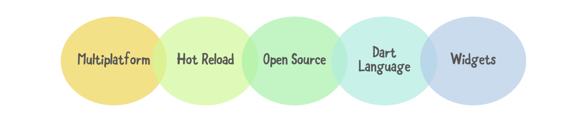
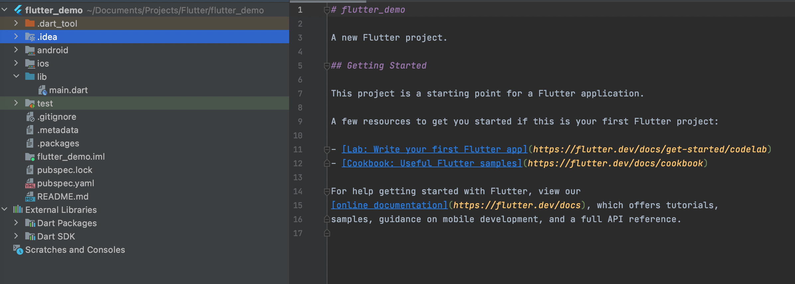

# Giới thiệu về Flutter và Dart
## 1. Dart/ Flutter là gì?(Hải)
**Dart là gì?**

- Dart là ngôn ngữ lập trình đa mục đích ban đầu được phát triển bởi Google và sau đó được Ecma (ECMA-408) phê chuẩn làm tiêu chuẩn. Nó được sử dụng để xây dựng các ứng dụng web, server, máy tính để bàn và thiết bị di động.

**Flutter là gì?**

- Flutter là một framework của Google giúp chúng ta tạo được các ứng dụng chạy trên được nhiều nền tảng như web, android, ios, desktop.
- Sử dụng ngôn ngữ lập trình Dart

## 2. Giới thiệu về Dart(Hải)
> Dart là một ngôn ngữ hướng đối tượng, được xác định theo lớp, với cơ chế garbage-collected, sử dụng cú pháp kiểu C để dịch mã tùy ý sang . Nó hỗ trợ interface, mixin, abstract, generic, static typing và sound type (2 cái cuối có thể hiểu là type-safe). Dart là ngôn ngữ mã nguồn mở và miễn phí, được phát triển trên [GitHub](https://github.com/dart-lang).

#### Tại sao lại chọn Dart?
Các nhà phát triển tại Google và các nơi khác sử dụng Dart để tạo các ứng dụng chất lượng cao, quan trọng cho iOS, Android và web. Với các tính năng nhắm đến sự phát triển phía khách hàng, Dart rất phù hợp cho cả ứng dụng di động và web. Dart giúp bạn tạo ra những trải nghiệm đẹp, chất lượng cao trên tất cả các màn hình, với:

- Một ngôn ngữ được tối ưu hóa cho client
- Framework mạnh mẽ
- Công cụ linh hoạt

#### Những ưu điểm của Dart
**Năng suất** Cú pháp Dart rõ ràng và súc tích, công cụ của nó đơn giản nhưng mạnh mẽ. Type-safe giúp bạn xác định sớm các lỗi tinh tế. Dart có các thư viện cốt lõi và một hệ sinh thái gồm hàng ngàn package.

**Nhanh Dart** cung cấp tối ưu hóa việc biên dịch trước thời hạn để có được dự đoán hiệu suất cao và khởi động nhanh trên các thiết bị di động và web.

**Di động** Dart biên dịch thành mã ARM và x86, để các ứng dụng di động của Dart có thể chạy tự nhiên trên iOS, Android và hơn thế nữa. Đối với các ứng dụng web, chuyển mã từ Dart sang .

**Dễ gần** Dart quen thuộc với nhiều nhà phát triển hiện có, nhờ vào cú pháp và định hướng đối tượng không gây ngạc nhiên của nó. Nếu bạn đã biết C ++, C # hoặc Java, bạn có thể làm việc hiệu quả với Dart chỉ sau vài ngày.

**Reactive** Dart rất phù hợp với lập trình Reactive, với sự hỗ trợ để quản lý các đối tượng tồn tại trong thời gian ngắn, chẳng hạn như các widget UI, thông qua phân bổ đối tượng nhanh và GC. Dart hỗ trợ lập trình không đồng bộ thông qua các tính năng ngôn ngữ và API sử dụng các đối tượng Future và Stream.


## 3. Dart Cheat Sheet and Quick Reference(Hạnh)

- Kiểu dữ liệu
  - Chia thành 2 kiểu dữ liệu:
    1. Static ( int, double, String, bool, StringBuffer, RegExp, List, Map, Set, DateTime, Duration, Uri, Error...)
    2. Dynamic ( var, dynamic)
  
- Toán tử thường gặp
  - Toán tử số học(+,-,*,/,%)
  - Toán tử gán:+=,-=.*=,/=,%=
  - Toán tử so sánh:>,<,>=,<=,!=,==,&&,||

- Cấu trúc rẽ nhánh, vòng lặp
  - Cấu trúc if...else
  - Cấu trúc switch...case
  - Cấu trúc vòng for , for...in
  - Cấu trúc while, do...while

- List
  - Khai báo :
    ```
       List list5 = [4, 3, 5, 8];
       List <int> list = new List<int>(5);
    ```
    - Phương thức : add, clear , isEmpty, isNotEmpty

- Set
  - Khai báo :
    - Set gần giống List
      ```
         Set set = new Set();
         Set<int> set1 = Set<int>();
         Set set2 = {21, 22, 23};
         Set set3 = new Set.from([31,32,33]);
      ```
  
- Nullable variables
  - Phải từ sdk <= 2.12
    ```
       environment:
          sdk: '>=2.12.0 <3.0.0'
    ```
  - Biến kiểu int không được có giá trị null
    ```
       int a = null; // INVALID in null-safe Dart.
    ```
  - Thật tế nó phải như thê này
    1. biến có thể là null:
       ```
          int? a = null; // Valid in null-safe Dart.
       ```
    2. null là giá trị mặc định cho các biến chưa khởi tạo
       ```
          int? a; // The initial value of a is null.
       ```

## 4. Viết app “Hello World” bằng Flutter(Hạnh)

- Đầu tiên chúng ta phải cài đặt cho lập trình Flutter

    

- Tiếp theo là tạo project, bắt đầu nào.

    
    
    
    

- Tiếp theo là tạo một StatefulWidget MyApp bằng cách gõ stf + esc. 

    

- việc tạo StatefulWidget cho class MyApp đã xong  giờ thì mình có thể tạo StatefulWidget với class HomeScreen() và không quên import.
    

- Hoàn thành công việc còn lại.

    

- Bước cuối cùng rất quan trọng build lên và test lại thành quả của mình.

    

## 5. Cấu trúc một chương trình Flutter/Dart(An)
### 1. Flutter
 

### 2. Cấu trúc chung của một chương trình Flutter/Dart
Một chương trình viết bằng Dart ít nhất phải có một hàm main(), như ví dụ dưới đây.
``` dart
void main() {
  print('Hello world!');
}
```
Hàm main() là một hàm đặc biệt, nó báo cho trình biên dịch Dart biết điểm bắt đầu để thực hiện chương trình và
khi chạy chương trinhg nó sẽ được tìm và thực thi đầu tiên.

### 3. Các thành phần của một Project Flutter

 

- android − Thư mục code sinh tự động cho ứng dụng Android
- ios − Thư mục code sinh tự động cho ứng dụng iOS
- lib − Main folder chứa Dart code được viết khi sử dụng flutter framework
- ib/main.dart − File đầu tiên là điểm khởi đầu của ứng dụng Flutter application
- test − Folder chứa Dart code để test flutter application
- test/widget_test.dart − Sample code
- .gitignore − Git version control file - File này chứa cấu hình cho project git
- .metadata − sinh tự động bởi flutter tools
- .packages − sinh tự động để theo dõi flutter packages
- .iml − project file của Android studio
- pubspec.yaml − Được sử dụng  Pub, Flutter package manager
- pubspec.lock − Sinh tự động bởi Flutter package manager, Pub
- README.md − Project description được viết theo cấu trúc Markdown

##### Một chương trình đơn giản(Chi tiết sẽ tìm hiểu ở phần sau :))
``` dart
//Import flutter package, tên là material. Material là một flutter package được sử dụng để tạo giao diện người dùng theo Material design cho Android.
import 'package:flutter/material.dart';

//runApp và đưa giao diện widget vào hiển thị trên màn hình
void main() {
  runApp(MyApp());
}

//Widget được sử dụng để tạo UI
class MyApp extends StatelessWidget {
  @override
  Widget build(BuildContext context) {
    return MaterialApp(
      title: 'Flutter Demo',
      theme: ThemeData(
        primarySwatch: Colors.blue,
      ),
      home: MyHomePage(title: 'Flutter Demo Home Page'),
    );
  }
}

//Widget được sử dụng để tạo state UI
class MyHomePage extends StatefulWidget {
  MyHomePage({Key? key, required this.title}) : super(key: key);
  final String title;

  @override
  _MyHomePageState createState() => _MyHomePageState();
}

//Widget được sử dụng để tạo UI
class _MyHomePageState extends State<MyHomePage> {

  @override
  Widget build(BuildContext context) {
    return Scaffold(
      appBar: AppBar(
        title: Text(widget.title),
      ),
      body: Center(
        child: Column(
          mainAxisAlignment: MainAxisAlignment.center,
          children: <Widget>[
            Text(
              'Hello world!',
            ),
          ],
        ),
      ),
    );
  }
}
```


## 6. Biến và các kiểu dữ liệu trong Dart(An, Anh)

### 1. Kiểu null trong Dart
Để khai báo một biến trong chương trình, chúng ta sử dụng cú pháp:
        `var tên_biến;` hoặc `kiểu_dữ_liệu_của_biến tên_biến;`
    
```
main() {
    // Khai báo biến a, khởi tạo nó lưu một chuỗi
    // (do vậy a có kiểu String, nó chỉ lưu chuỗi)
    var a = "Learn Dart";

    a = "Learn Dart 2";   // Gán chuỗi khác
    a = 100;              // Lỗi vì gán số vào a

    // Khai báo và không khởi tạo
    // biến b sẽ có giá trị null - lúc này
    // kiểu của b tùy thuộc vào giá trị gán vào nó
    var b;
    b = 100;            // Gán số vào b
    b = "aaa";          // Gán chuỗi vào b
}
```

*Chú ý, bắt đầu từ phiên bản 2.0, Dart/Flutter chính thức hỗ trợ null safety, do đó bạn thể không khai báo như ách trên được. Bạn click để hiêu thêm [Null Safety Dart / Null Safety Flutter là gì](https://o2.edu.vn/null-safety-dart-null-safety-flutter-la-gi/)*

Ngoài ra có thể khai báo nhiều biến cùng lúc (thường các biến có cùng kiểu), chúng ta sử dụng cú pháp:
        `var tên_biến1, tên_biến2;` hoặc `kiểu_dữ_liệu_của_biến tên_biến1, tên_biến2, tên_biến 3;`

Nếu giá trị ban đầu của biến không được gán thì tất cả đều có giá trị là `null`
```
void main() {
  int a, b;
  print(a+b);
}
```
Chương trình biên dịch báo lỗi như sau:


- **Null safety** - các biến không thể nhận giá trị null trừ khi mình chỉ rõ.

*Ex:*
```
int a; // error
int? a = null; // ok
var a = null; // ok
```
- Điều này giúp chuyển các lỗi null-dereference thành lỗi cú pháp.
! dùng force từ null sang non null
*Ex:*
```
  int? a;
  print(a!); // error
```
- Late  sử dụng khi chúng ta chưa biết giá trị của nó.
*Ex:*
```
late int a; // non-error
```

### 2. Kiểu số nguyên int và kiểu số thực double
- **Integer** biểu diễn dạng số nguyên và từ khoá *int*. Đổi chữ số thành số nguyên:
```
int numint = int.parse("120");
```

- **Double** biểu diễn dạng số thực dấu phẩy động với từ khoá *double*. Đổi chuỗi thành số thực:
```
var abc = double.parse("123.123");
```
Cả số nguyên và số thực đều có các phép toán để tạo thành biểu thức(cộng, trừ, nhân, chia). Trên các đối tượng số này có các phương thức để chuyển đổi kiểu *toString(), toInt(), toDouble()*

### 3. Kiểu logic bool trong Dart
- **Booleans**: được biểu diễn bởi 2 giá trị *true* và *false* với từ khoá *bool*

```
bool found = true;
```

### 4. Kiểu xâu String trong Dart / Flutter
-**Strings**: Được dùng để biểu diễn chuỗi ký tự. Nó được nhập vào trong cặp nhay đơn '' hoặc nháy kép "". Dùng ký hiệu \', \' để biểu diễn ký tự nhay đơn('') trong chuỗi:

```
String a = 'Chuỗi ký tự \'\' (nháy đơn)';  // Chuỗi ký tự '' (nháy đơn)
String b = "Chuỗi ký tự \"\" (nháy kép)";  // Chuỗi ký tự "" (nháy kép)
```

```
var a = "Learn Dart";
  print('A = $a'); // kết quả: A = Learn Dart
```

Để nối các chuỗi lại với nhau dùng toán tử +, kiểm tra hai chuỗi giống nhau thì có thể dùng ==, hoặc so sánh hai đối tượng giống nhau trong memory dùng *identical(a,b)*

Muốn nhập chuỗi trên nhiều dòng, dùng cú pháp sau, các dòng nằm giữa cặp ... hoặc ***:
```
String s1 = '''
Các dòng
chữ trong chuỗi s1
''';
```
Có thể chèn một biến hoặc một biểu thức vào chuỗi bằng cách ký hiệu $tên_biến, ${biểu thức giá trị}

### 5. Kiểu danh sách List trong Dart/Flutter
- **List<T>** biểu diễn một nhóm các đối tượng được sắp xếp và có thiết kế giống như mảng(array) trong các ngôn ngữ khác. 

```
List<int> soPi = [3,2,4,1,6,6];
```

- Các phương thức thuộc tính hay dung trong mảng:
    - `reversed`: Trả về một đội tượng `Iterable` chứa các phần tử mảng theo thứ tự ngược lại
    - `add()`: Thêm một phần tử vào cuối `add {element}`
    - `insert`: Chèn một phần tử vào cuối `add { element }`
    - `insertAll()`: Chèn một `Iterable` bắt đầu từ vị trí i: `insertAll(i, iterable)`
    - `remove()`: Xoá bỏ phần tử đầu tiên tìm thấy có giá trị chỉ ra `remove {data}`
    - `removeAt()`: Xoá bỏ phần tử ở vị trí i `removeAt(i)`
    - `removeLast`: Xoá bỏ phần tử cuối
    - `removeRange`: Xoá bỏ phần tử từ vị trí start đến vị trí end `removeRange(start, end)`

### 6. Kiểu ánh xạ Map trong Dart/Flutter
- **Map<dynamic, dynamic>{}** kiểu dữ liệu biểu diễn một tập đối tượng không được sắp xếp ở dạng <key, value>, dùng ký hiệu `{}` để khởi tạo Map hoặc khởi tạo bằng `Map()`. Truy cập đến phần tử của Map dùng ký hiệu chấm `.key`

```
var dow = {
    'T2' : 'Thứ 2',
    'T3' : 'Thứ 3',
    'CN' : 'Chủ Nhật'
};

print(dow.length);                     //Số phần tử
print(dow['T2']);                      //Truy cập phần tử chỉ số T2
dow.putIfAbsent('T4', () => 'Thứ 4');  //Thêm phần tử mới nếu chưa có

//Cũng có thể tạo ra Map bằng
//var dow = new Map();
```

- Các phương thước / thuộc tính hay dùng trên Map:

    - `addAll`: Thêm các phần tử từ một map khác `addAll(othermap)`
    - `clear`: Làm rỗng Map `clear()`;
    - `containsKey`: `containsKey(key)` kiểm tra phần tử với `key` tồn tại
    - `remove()`: `remove(key)` xoá phần tử khỏi map

### 7. Kiểu dữ liệu tập hợp Set
- **Set<T>**: là một tập hợp không theo thứ tự của các phần tử riêng biệt. Điều này đồng nghĩa các phần tử đó sẽ không có một vị trí cụ thể ở trong Set. Do đó, một Set sẽ không thể có các bản sao của cùng một phần tử (giống Set ở Swift)

- Các kiểu khai báo:
```
var x = Set();
Set set = new Set();
Set<int> set1 = Set<int>();
Set set2 = {1, 2, 3};
Set set3 = new Set.from([4,5,6]); // Xem rõ hơn ở trường hợp dưới

var list = [4,5,6]
Set set4 = new Set.from(list);
print (set4); // Kết quả: {4, 5, 6}
```

### 8. Dynamic
- **Dynamic Type**: *dynamic* trong Dart có thể hiểu là kiểu dữ liệu tuỳ chọn. Đây là kiểu cơ bản cho mọi kiểu dữ liệu trong Dart. Kiểu dữ liệu của một biến nếu không được chỉ định rõ ràng thì sẽ được gán với từ khoá *dynamic*

```
dynamic dyn = 123; // Khởi tạo là số int
  dyn = "Dynamic"; // Gán chuỗi
  dyn = 1.12345; // Gán số double
  dyn = 1; // Gán int
  print("dyn = " + dyn.toString());
```

*Kết quả:*

```
dyn = 1
```

### 9. Kiểu liệt kê thứ tự enum
Kiểu enum trong Dart còn gọi là *kiểu liệt kê* (kiểu liệt kê thứ tự enumerated) được sử dụng để liệt kê các giá trị hằng số. Kiểu liệt kê được khai bào bằng cách sử dụng từ khoá `enum`. Kiểu liệt kê `enum` cũng là 1 kiểu `iterable`, tức là cũng có thể duyệt tuần tự qua từng phần tử của nó
```
enum HoaQua { Apple, Pear, Grapes, Banana, Orange }
void main() {
  HoaQua liked = HoaQua.Apple;
  var disliked = HoaQua.Banana;
  print(liked.toString()); // kết quả 'HoaQua.Apple'
  print(disliked.toString()); // kết quả 'HoaQua.Banana'
}
```

```
enum UserGroup { guest, member, admin }

var userGroup = UserGroup.admin;
  
void func() {
    switch (userGroup) {
      case UserGroup.guest:
        print('guest');
        break;
      case UserGroup.member:
        print('member');
        break;
      default: 
        print('admin');
        break;
    }
}
```

- Một số cách biến đổi có thể dùng Enum linh hoạt hơn tương tự như Swift:

```
enum Sex { male, female , other }
extension on int {
  Sex toSex() {
    switch (this) {
      case 1:
        return Sex.male;
      case 0:
        return Sex.female;
      default:
        return Sex.other;
    }
  }
}

```

```
enum Sex { male, female , other }
Future<void> main1() async {
  var sex = 1.toSex();
  switch (sex) {
    case Sex.male:
      print('male');
      break;
    case Sex.female:
      print('female');
      break;
    case Sex.other:
      print('female');
      break;
  }
}
```

```
enum Sex { male, female , other }
extension on Sex {
  int getRawValue() {
    switch(this) {
      case Sex.male:
        return 1;
      case Sex.female:
        return 0;
      case Sex.other:
        return -1;
    }
  }
}

```


Mỗi phần tử của một `enum` được gnas với một con số, gọi là `index`, tương ứng với vị trí của phần tử đó trong `enum` bắt đầu từ số 0
```
enum HoaQua { Apple, Pear, Grapes, Banana, Orange }
void main() {
  print(HoaQua.Apple.index); //kết quả 0
  print(HoaQua.Banana.index); //kết quả 3
}
```

### 10. Iterator trong Dart là gì?
#### 10.1 Khái niệm
Iterator trong Dart là một tập hợp các giá trị, hoặc "phần tử", có thể được truy cập tuần tự. Nói cách khác lớp `Iterator` bao gồm các đối tượng có thể duyệt (Iterable) tuần tự, tức là cho phép ta lấy từng phần tử của nó, hành động này có thể được lặp đi lặp lại. Ví dụ, `List` và `Set` đều là các `Iterable`

Trong Dart, một `Iterator/Iterable` là một lớp trừu tượng, có nghĩa là bạn không thể khởi tạo trực tiếp nó. Tuy nhiên, bạn có thể tạo mới Interable bằng cách tạo mới một danh sách `List` hoặc tập hợp `Set`

- Ví dụ:
```
void main() {
  var iterable = ['Salad', 'Popcorn', 'Toast'];
  for (var element in iterable) {
    print(element);
  }
}
```

Trong ví dụ trên thì biến `iterable` chính là 1 `List`, chúng ta sử dụng từ khoá `var` nên Dart sẽ tự nhận dạng kiểu dữ liệu cho chúng ta. Để tạo một Iterator, chúng ta chỉ có cách sử dụng phương thức `iterator` đối với các biến thuộc kiểu `List, Set...`

#### 10.2 Truy cập các phần tử của lớp Iterator
Với lớp `Iterator`, bạn không thể truy cập trực tiếp các phần tử như lớp `List` mà phải lần lượt duyệt qua tất cả các phần tử phía trước. Thay vào đó, bạn có thể đọc các phần tử với `elementAt()` bằng cách duyệt qua các phần tử lần lượt của nó cho đến khi đạt đến vị trí đó

Chính vì lí do đó, bạn không thể gọi `iterable[0]` để truy cập phần tử đầu tiên của biến `iterable` mà phải sử dụng thuộc tính `first`, lấy phần tử đầu tiên. Tương tự, bạn không thể sử dụng `[]` để truy cập phần tử cuối cùng, nhưng bạn có thể sử dụng thuộc tính `last`

- Ví dụ
```
void main() {
  Iterable numbers = [0, 1, 2, 3, 4, 5, 6, 7, 8, 9, 10];  
  int value = numbers.elementAt(3);
  print(value); //kết quả 3
  print('The first value is ${numbers.first}');//kết quả 0
  print('The last value is ${numbers.last}');//kết quả 10
}
```

*Lưu ý: Việc truy cập phần tử cuối cùng của một `Iterator` yêu cầu phải duyệt qua tất cả các phần tử khác nên có thể rất chậm*

Để duyệt qua các phần tử của một `Iterator`, bạn có thể sử dụng vòng lặp `for`

#### 10.3 Các thuộc tính và phương thức của kiểu Iterator trong Dart
- `current` trả về phần tử hiện tại của một `Iterator`
- `moveNext()` trả về `true` nếu phần tử hiện tại chưa phải là phần tử cuối cùng đồng thời đặt phần tử `current` là phần tử tiếp theo, trả về `false` nếu phần tử hiện tại đang là phần tử cuối cùng của một `Iterator` và đặt `iterator.current = null`
- `firstWhere()` để tìm phần tử đầu tiên thoả mãn các điều kiện nhất định
- `singleWhere()` có thể giúp bạn tìm một phần tử thoả mãn một vị trí nhất định
- `where()` sử dụng để tìm tất cả các phần tử thoả mãn một điều kiện nào đó
- `any()` trả về *true* nếu có ít nhất một phần tử thoả mãn điều kiện
- `every()` trả về *true* nếu tất cả các phần tử thoả mãn điều kiện

Duyệt qua các phần tử của `List` bằng vòng lặp `for`
```
void main(){
    //list
    var myList = [25, 63, 84];
     
    //traverse through each element of list
    for(var i=0;i<myList.length;i++){
        print(myList[i]);
    }
}
```

hoặc sử dụng phương thức `forEach` của kiểu `List`
```
void main(){
    var myList = [24, 63, 84];
     
    myList.forEach((element) => 
        print(element)
    );
}
```

hoặc chuyển `List` sang `Iterator` và sử dụng vòng lặp `while`
```
void main(){
    //list
    var myList = [25, 63, 84];
     
    //get iterator to the list
    var myListIter = myList.iterator;
     
    //iterate over the list
    while(myListIter.moveNext()){
        print(myListIter.current);
    }
}
```

Kiểu `Map` không phải là một đối tượng `Iterable`,  tuy nhiên bạn có thể duyệt qua từng phần tử của `Map` bằng cách sử dụng thuộc tính `key` và `value` của nó
```
void main() {

  Map kidsBooks = {
    'Matilda': 'Roald Dahl',
    'Green Eggs and Ham': 'Dr Seuss',
    'Where the Wild Things Are': 'Maurice Sendak'
  };
  for (var book in kidsBooks.keys) {
    print('bookwaswrittenby{kidsBooks[book]}');
  }
}
```

## 7. Các phép toán trong Dart (Toán tử trong Dart / Flutter)(Anh)
### 1. Toán tử số học trong Dart
- `+`: Phép cộng
- `-`: Phép trừ
- `*`: Phép nhân
- `/`: Phép chia
- `~/`: Phép chia lấy phần nguyên. Vd: `6 ~/ 4` kết quả `1`
- `%`: Phép chia lấy phần dư. Vd: `6 % 4` kết quả `2`
- `-biểu_thức`: Đổi dấu kết quả biểu thức. Vd: `-(5 - 6)` kết quả `1`
- `++var`: `var = var + 1`. thêm 1 vào `var`, trong biểu thức việc tăng này được thực hiện trước
```
var a = 5;
var c = 10 + (++a);  //a tăng thêm 1, a thành 6
print(a);            //6
print(c);            //16
```
- `var++`: `var = var + 1`. Thêm 1 vào `var`, trong biểu thức việc tăng này được thực hiện sau
```
var a = 5;
var c = 10 + (a++);  //Tính c với a = 5, sau đó mới tăng a
print(a);            //6
print(c);            //15
```
- `--var`: `var = var - 1`. Bớt var đi 1, việc bớt này thực hiện trước trong biểu thức
- `var--`: `var = var - 1`. Bớt var đi 1, việc bớt này thực hiện sau trong biểu thức

### 2. Phép gán trong Dart
- Phép gán là `=`, để thực hiện gán giá trị biểu thức bên phải vào biến ở phía bên trái toàn tử
        `biến = biểu _thức;`
        `var a = 1 + 2 + 3 + 4;`

- Phép toán gán có trường hợp viết phức tạp kết hợp cùng một toán tử khác phía trước dạng `toán_tử_trước =` như `+=, -=, *=, /=`. Điều này có nghĩa là biến và biểu thức bên phải thực hiện toán tử phía trước, giá trị được bao nhiêu thì gán vào biến

```
a *= 5;  // Tương đương a = a * 5;
a += 5;   // Tương đương a = a + 5;
a /= 5;   // Tương đương a = a / 5;
```

### 3. Toán tử so sánh trong Dart
- Các toán tử này thực hiện trên biểu thức logic, kết quả là `true` hoặc `false`
    - `==`: So sánh bằng `5 == 5` kết quả `true`, `5 == 6` kết quả `false`
    - `!=`: So sánh khác `5 != 5` kết quả `false`, `5 != 6` kết quả `true`
    - `>`: So sánh lớn hơn `5 > 5` kết quả `false`, `6 > 5` kết quả `true`
    -`<`: So sánh nhỏ hơn `5 < 5` kết quả `false`, `5 > 6` kết quả `true`
    - `<=`: So sánh nhỏ hơn hoặc bằng
    - `>=`: So sánh lớn hơn hoặc bằng

### 4. Toán tử logic trong Dart
- `||`: Phép logic hoặc, `a || b` kết quả `true` nếu `a` hoặc `b` là `true`
- `&&`: Phép logic và, `a && b` kết quả `true` nếu `a` và `b` đều `true`
- `!biểu_thức`: Phép phủ định `!a` nếu `a` là `true` thì kết quả phép toán là `false`

### 5. Biểu thức điều kiện
        `biểu_thức_điều_kiện ? biểu_thức_1 : biểu_thức_2`
- Biểu thức tổng hợp trên kết hợp từ ba biểu thức con. Nếu điều kiện là đúng thì giá trị tính theo `biểu_thức_1`, ngược lại thì `biểu_thức_2`

```
var a = 4;
var b = 10;
var d = (a > b) ? a : b;
//Kết quả d = 10
```

        `biểu_thức_1 ?? biểu_thức_2`
-  Biểu thức kết hợp với `??`, nếu `biểu_thức_1` khác null thì lấy `biểu_thức_1`, ngược lại lấy giá trị từ `biểu_thức_2`

### 6. Một số toán tử trên lớp, đối tượng
- `[]`: Truy cập phần tử mảng
- `.`: Truy cập phương thức, thuộc tính đối tượng
- `.`: Truy cập phương thức, thuộc tính đối tượng khi đối tượng đó khác null `myobject?.method();`
- `as`: Chuyển kiểu: `(var as MyClass)`
- `is`: Kiểm tra kiểu: `(var is MyClass)`
- `is!`: Kiểm tra kiểu: (var is! MyClass)

## 8. Câu lệnh điều khiển luồng chương trình (control flow)(A. Thịnh)

### 1. Câu lệnh điều kiện if

```js
if (3 > 2) {
print('Đúng');
} else if (4 > 5) {
print('Vào else if');
} else {
print('Vào else');
}
```

### 2. Câu lệnh lựa chọn switch

Dùng switch với cú pháp

```js
switch (biểu_thức) {
    case : giá_trị_1
      // Khối lệnh
      break;
    case : giá_trị_2
      //Khối lệnh
    break;
    default:
      //Khối lệnh mặc định
}
```

Giá trị của `biểu_thức` được so sánh với các giá trị `giá_trị_1`, `giá_trị_2` ... nếu bằng cái nào thì thi hành khối lệnh bắt đầu tử điểm đó cho đến khi gặp `break;`

Nếu có khối `default` thì khi không có giá trị nào phù hợp sẽ thi hành khối này.

```js
var t = 0;
switch(t) {
    case 0:
      print('Chủ Nhật');
    break;
    case 1:
      print('Thứ 2');
    break;
    default:
      print('Không có giá trị nào');
}
```

### 3. Câu lệnh vòng lặp for và while

Cú pháp:

```js
for (statement1; statement2; statement3) {
    Khối lệnh thi hành
}
```

- `statement1` : lệnh thi hành trước khi vòng lặp `for` bắt đầu
- `statement2` : điều kiện kiểm tra trước mỗi lần thi hành khối lệnh `for` (`true` thì khối lệnh sẽ thi hành, `false` sẽ khối for sẽ không thi hành - thoát lặp)
- `statement3` : thi hành sau mỗi lần một vòng hoàn thành

```js
for (var i=1; i<=5; i++) {
    print(i);
}
//In ra
    1
    2
    3
    4
    5
```

Có thể bỏ qua `statement1` (vẫn giữ lại dấu `;`)

```js
var i = 1;
for (; i<=5; i++) {
    print(i);
}
//In ra
    1
    2
    3
    4
    5
```

Tương tự bạn có thể bỏ qua `statement3` và `statement2` (vẫn giữ `;`), lưu ý bạn cũng có thể sử dụng lệnh `break;` để thoát vòng lặp.

```js
var k = 0;
for (;;k+=2) {
  if (k>10) break;
  print(k);
}
    //In ra
    2
    4
    6
    8
    10
```

Thi hành khối lệnh khi mà điều kiện kiểm tra vẫn là `true`

```js
while (điều-kiện) {
   //Khối lệnh
}
```

Đầu tiên nó kiểm tra điều kiện, nếu `true` sẽ thi hành khối lệnh. Đến cuỗi khối lại kiểm tra điều kiện, nếu điều kiện vẫn là `true` thì lại tiếp tục thì hành vòng mới của khối lệnh.

```js
var i=0;
while (i<=5) {
    print(i);
    i++;
}
//In ra
    0
    1
    2
    3
    4
    5
```

Lưu ý về việc sau một số vòng thì điều kiện phải là `false` nếu không vòng lặp sẽ lặp lại vô tận.Giống với 

Vòng lặp `while` nhưng khối lệnh thi hành luôn mà không kiểm tra điều kiện trước, khi khối lệnh thi hành xong mới kiểm tra điều kiện để xem có lặp lại hay không

Cú pháp

```js
do {
   //Khối lệnh
}
while (condition);
```

Ví dụ

```js
var i=20;
do {
    print(i);
    i++;
}
while (i<=25);

    //In ra
    20
    21
    22
    23
    24
    25
```

Vòng lặp **do ... while** khối lệnh luôn được thi hành ít nhất một lần

Trong vòng lặp khi gặp `continue;` nó sẽ bỏ qua các lệnh còn lại và khởi tạo vòng lặp mới luôn. Còn nếu gặp `break;` thì bỏ qua các lệnh còn lại đồng thời thoát khỏi vòng lặp.

```js
for (i = 0; i <= 70000; i++) {
   if (i == 5) {
      continue;                         //Khởi tạo vòng lặp mới luôn
   }
   print(i);
   if (i >=7) {
        break;                          //Thoát lặp nếu i >=7
    }
}
//In ra các số: (bỏ qua 5)
0
1
2
3
4
6
7
```

Lệnh `continue` còn dùng để nhảy đến một khối lệnh có nhãn bằng cú pháp

```js
continue nhãn_khối_lệnh;
```

Lệnh `break` còn dùng để hủy thi hành khối lệnh bên ngoài có nhãn, với cú pháp:

```js
break nhãn_khối_lệnh_ngoài;
```

Phần nói về các đối tượng có kiểu liệt kê được (ví dụ như mảng, danh sách ...), còn có các lệnh duyệt qua từng phần tử liệt kê được đó với các lệnh `for ... in`, `for ... of`.

### 4. Câu lệnh điều kiện assert

Dart cung cấp lệnh Assert(biểu_thức_logic); để khi chạy mà biểu thức logic sai sẽ dừng chương trình ở đó. Assert là cách để kiểm tra một biểu thức, vấn đề là nó không có ảnh hưởng gì khi chạy ở chế độ product nó chỉ tác dụng khi phát triển (Chạy debug Ctrl + F5 trong VS)

```js
// Đảm bảo một đối tượng khác null
assert(myobject != null);

// Đảm bảo số lớn hơn 100
assert(number > 100);
```

## 9. Hàm trong Dart/Flutter(A. Thịnh)

### 1. Khai báo và định nghĩa hàm

Hàm là một khối lệnh thực hiện một tác vụ gì đó, khối lệnh này được dùng nhiều lần nên gom chúng tại thành một hàm. Trong Dart mọi thứ đều là đối tượng nên hàm cũng là một đối tượng (kế thừa Function).

Đây là một khai báo hàm

```js
double tinhtong(var a, double b, double c) {
  return a + b + c;
}
//HOẶC
double tinhtong(var a, double b, double c) {
  return a + b + c;
}

//GỌI HÀM
var x = tinhtong(1,2,3);
print(x); //6.0
```

Như vậy khi khai báo hàm ta có thể có các thành phần sau:

- Chỉ ra kiểu giá trị trả về của hàm (ví dụ `double`), giá trị trả về bằng biểu thức của lệnh `return`. Với Dart thiếu việc khai báo kiểu giá trị trả về hàm vẫn hoạt động tốt. Còn khi có chỉ rõ kiểu trả về thì giá trị trong biểu thức `return` phái trùng với kiểu khai báo hàm.
- Tham số được liệt kê sau tên hàm trong cặp `()` như trên có ba tham số a,b,c
- Hàm kết thúc khi chạy hết khối lệnh hoặc gặp lệnh `return`, giá trị hàm là biểu thức sau `return`, nếu thiếu giá trị hàm sẽ là `null`
- Gọi hàm thì viết tên hàm và truyền đúng tham số theo thứ tự yêu khai báo

### 2. Hàm nặc danh anonymous

Hầu hết các function đều có tên, như `main()` hoặc `printElement()`. Bạn cũng có thể tạo những function "vô danh" hay còn gọi là *anonymous function*, hoặc *lambda* (với anh em Java hay Kotlin có vẻ sẽ hay dùng từ này) hoặc *closure* (anh em Swift thì có thể sẽ quen với từ này). Bạn có thể gán nó cho 1 variable hay có thể add hay remove khỏi một collection như một element bình thường.

Anonymous function nhìn có vẻ giống như một function bình thường, chỉ khác là nó không có tên:

```js
([[Type] param1[, …]]) {
  codeBlock;
};
```

Ví dụ ở dưới, chúng ta sẽ tạo một anonymous function với parameter là `item` và không xác định type cho nó. Chúng ta truyền anonymous function cho function `forEach`, và anonymous function được gọi bên trong function `forEach`:

```js
var list = ['apples', 'bananas', 'oranges'];
list.forEach((item) {
  print('${list.indexOf(item)}: $item');
});
```

Hầu hết khai báo hàm là có tên hàm, tuy nhiên trong nhiều ngữ cảnh khai báo hàm và không dùng đến tên, hàm đó gọi là hàm ẩn danh còn gọi là `lambda` hoặc `closure`

Tạo ra hàm ẩn danh thì làm như hàm có tên bình thường, chỉ có điều phần kiểu trả về và tên bị thiếu.

```js
(var a, var b) {
    return a + b;
};

//Có thể dùng ký hiệu mũi tên  () => {}
(var a, var b) => {
    return a + b;
}

//Nếu chỉ có 1 biểu thức trả về như trên có thể viết gọn hơn
(var a, var b) => return a + b;
```

Khai báo trên là hàm ẩn danh, nhưng để sử dụng nó thì ra lệnh cho nó chạy luôn hoặc gán nó vào một biến rồi dùng biến gọi hàm.

```js
//Khai báo xong chạy luôn
var x = (var a, var b) {
    return a + b;
}(5,6);

print(x);                   //11
```

```js
//Gán hàm ẩn danh vào biến ham, rồi dùng nó chạy
var ham = (var a, var b) {
    return a + b;
};

print(ham(10,11));          //21
```

Hàm ẩn danh rất tiện dụng để làm tham số (callback) trong các hàm khác, thậm chí khai báo luôn một ẩn danh ở tham số hàm

```js
f1(var a, var b, var printmessage) {
     var c = a + b;
     printmessage(c);
}


f1(1, 2, (x) { print('Tổng là: $x');});         //Tổng là: 3
f1(1, 2, (z) => print('SUM = $z'));             //SUM = 3
```

### 3. Truyền tham số cho hàm

Nếu bạn muốn tham số có giá trị mặc định, nghĩa là khi gọi hàm mà thiếu giá trị cho tham số đó, thì nó sẽ nhận mặc định. 
Ví dụ

```js
double tinhtong(var a, {double b:1, double c:2}) {
  return a + b + c;
}

var v1 = tinhtong(1);
print(v1); //4.0

var v2 = tinhtong(1, c:10);
print(v2);  //12.0

var v3 = tinhtong(1, c:2, b:10);
print(v3); //13.0
```

Hàm trên tham số b mặc định là 1, c mặc định là 2. Nếu không chỉ ra tham số này khi gọi nó sẽ dùng mặc định, còn muốn chỉ ra khi gọi thì truyền theo cú pháp `tên_tham_số:giá_trị`, như ví dụ trên `tinhtong(1, c:2, b:10)`

* Hàm với tham số tùy chọn

Các tham số tùy chọn của hàm có nghĩa là khi họi hàm có sử dụng hoặc không. Các tham số tùy chọn gom lại trong `[]`, nếu khi gọi hàm không có tham số này thì nó nhận giá trị `null`

```js
double tinhtong(var a, [double b, double c]) {
   var tong = a;
   if (b != null)
    tong += a;

   tong += (c!=null) ?  c: 0;
}

print(tinhtong(1));       //1.0
print(tinhtong(1,2));     //3.0;
print(tinhtong(1,2,3));   //6.0;
```

* Hàm với kỹ hiệu mũi tên =>

Với những hàm chỉ có một biểu thức trả về luôn, thì có thể có cách viết ngắn gọn bằng ký hiệu mũi tên

```js
 double tinhtong(var a, var b) {
    return a + b;
  }

  // Có thể viết lại thành

  double tinhtong(var a, var b) => a + b;
```

## 10. Class trong Dart/Flutter

Class là định nghĩa cho hướng đối tượng. Nó đại diện cho những tập thuộc tính và phương thức cho tất cả các đối tượng của lớp này.

Cú pháp

```
class Student {

  // Properties
  String id;
  String name;
  String? age;

  // constructor
  Student({required this.id, required this.name, this.age});

  // methods
  String getName() {
    return name;
  }

  @override
  String toString() {
    return id + ' ' + name + ' ' + (age ?? '');
  }
}

```

Các thành phần trong class:
- Constructor: Hàm được gọi khi tạo ra đối tượng mới từ class
- Property: Các biến lưu giữ trạng thái của đối tượng gọi là thuộc tính
- Method: Các phương thức thuộc đối tượng

Cách sử dụng
`var student = Student(id: '1', name: 'Justin Nguyen');`

**Đặt tên cho hàm dựng**

```
class Student {
  // ...
  Student.math({required this.id, required this.name, this.age});  
  // ...
}
```

Nếu vậy bạn có thể khởi tạo bằng hàm dựng này
`var student = Student.math(id: '1', name: 'Justin Nguyen');`

**Hàm Getter/ Setter**

```
class Student {
  // ...
  get studentName {
    return this.name;
  }

  set studentName(name) {
    this.name = name;
  }
  // ...
}
```

## 11. Hướng đối tượng (OOP) trong Dart
Ngôn ngữ đart cũng có các tính chất của hướng đối tượng:
- Tính kế thừa
- Tính trừu tượng
- Tính đóng gói
- Tính đa hình

Sử dụng Mixin
Mixin là một lớp, nó không được sử dụng trực tiếp để tạo ra đối tượng, một mixin chứa các phương thức, thuộc tính dùng để gộp vào một lớp khác

```
mixin M {
  late int a;

  showSomeThing() {
    
  }
}

class Student with M {
	// ...
}
```

**PS: Từ khoá <span style="color:red">with</span> mang ý nghĩa gộp code chứ không mang ý nghĩa kế thừa**

**Toán tử cascade**
Khi bạn có một chuỗi tác vụ trên đối tượng(gọi phương thức, thiết lập thuộc tính) thay vì phải viết đầy đủ đối tượng thì bạn chỉ cần viết nó một lần, các lệnh tiếp theo có thể thay thể bằng <span style="color:red">..</span>

```
  var table = new Table(1);
  table
  ..calulateTotal()     //Thay cho table.calulateTotal();
  ..length=100          //Thay cho table.length=100;
  ..name='Abc'
  ..quantity=100
  ..showTotal();
```

## 12. Cài đặt Flutter với Android Studio và VSCode

- Download Visual Studio Code
    - [download](https://code.visualstudio.com/download)
    
- Download Android Studio
    - [download](https://developer.android.com/studio)

- macOS install Flutter:

[macOSInstall](https://flutter.dev/docs/get-started/install/macos)

- Install VSCode
    - Video hướng dẫn: [Install VSCode](https://www.youtube.com/watch?v=oWld-WlGvMI)
    - [Install VS Code](https://flutter.dev/docs/get-started/editor?tab=vscode)

## 13. Xử lý lỗi Migrate to Android X hoặc Your App is n’t Android X

- Tài liệu tham khảo
    - [AndroidX là gì? Vai trò và cách sử dụng](https://vncoder.vn/bai-viet/android-androidx-la-gi-vai-tro-va-cach-su-dung)
    - [AndroidX Migration](https://flutter.dev/docs/development/androidx-migration)
    - [Video](https://www.youtube.com/watch?v=0FZ_eUIsLTg)
    
- `AndroidX` là một cải tiến lớn đối với thư viện Android Support Library gốc. Cũng giống như Android Support Library, AndroidX phân phối riêng biệt với hệ điều hành Android và cung cấp khả năng tương thích ngược trên các phiên bản Android trước đó. Android X thay thế hoàn toàn Support Library bằng cách cung cấp tính năng hỗ trựo và những thư viện mới.

## 14. Phân biệt Hot reload vs Hot restart

- Hot reload
   - Hot reload là một chức năng tuyệt vời có ở flutter. Đây là chức năng dễ nhất và nhanh nhất giúp bạn áp dụng các thay đổi, sửa lỗi, tạo giao diện người dùng và thêm các tính năng. Khi hot reload, nó không phá hủy trạng thái được bảo toàn. Nhưng bạn không thể sử dụng hot reload khi ứng dụng bị tắt.
   - Thực hành nào
     - Theo như các bạn thấy thi nó sẽ build lại ở tại vị trí đó màn hình đó thay đổi ngay lập tức khi bấm hot reload
       
     https://user-images.githubusercontent.com/55979453/129153209-046a6b8c-95f0-464d-8422-9e499b29079c.mov
     
 - Hot restart    
   - Hot restart có một chức năng hơi khác so với hot reload, đó là hot reload nó nhanh hơn so với hot restart vì hot restart sẽ khởi động lại đầy đủ. Mất nhiều thơi gian hơn so với hot reload nhưng mất ít thơi gian hơn so với  full restart function.
   - Dưới đây là minh chứng cho việc chạy hot reload và hot restart khác nhau ra sao:
     - hot reload : thì chạy đúng màn hình có sự thay đổi
     - hot restart: thì chạy lại cả hàm main() 
       
     https://user-images.githubusercontent.com/55979453/129156032-4d58fe8b-f48f-4bce-aff0-8d4621073e18.mov

## 15. Cách sử dụng Pub.dev để import các package/thư viện Flutter
- Để add library **pub.dev** vào flutter việc đầu tiên chúng ta phải biết được mình muốn add library nào và add để làm gì
   - [pub.dev](https://pub.dev/)
     - Thứ nhất chung ta phải chọn được tên library mình cần sử dụng
     - Thứ hai chung ta phải xem liệu rằng nó có các yếu tố đặc biệt như phải thêm vào file **info.plist** của IOS thì mới chạy được hay không....., bằng cách xem Example của library đó. 
     - Dưới đây là 1 ví dụ điển hình.

      https://user-images.githubusercontent.com/55979453/129216378-df6acf0c-16ff-475e-947e-fbd7ba2cf6cd.mov
      
     - Chúng ta có thể thấy rằng video trên có cho chung ta thấy được Example, cách install, xem score.
 - Tạm thời bỏ qua phần lấy từ khoá để add library, chúng ta đến với việc thực hành nó nào.

     https://user-images.githubusercontent.com/55979453/129218587-7bd74de0-4482-4f2a-a31f-c30725997b4c.mov
     
   - Theo như các bạn đã thấy trong video trên khi minh add vào tên library vào file **pubspec.yaml** của project mình thì phải để đúng chỗ và không được thừa  khoảng trống, đúng hàng đúng cột.
   - Và thứ 2 là phải bấm **Pub get**, và **import** thư viện vào và dùng thôi.
   - Nhưng có một số lưu ý như sau. Nếu đã **Pub get** rồi **import** thư viện vẫn được nhưng build lên thì lại không có kết quả như ý. Mở cái teminal lên trỏ đến project của bạn và gõ **flutter clean** sau đó **flutter pub get**.
