# 2.Common UI Widget (Các Widget thông dụng của Flutter)
## 1. SO SANH STATEFULWIDGET vs STATELESSWIDGET(Hạnh)
 - STATE LÀ GÌ ?
   - Là “trạng thái” của UI
   - Khi State thay đổi thì UI thay đổi
   - State chỉ được dùng trong màn hình ( class ) sử dụng StatefulWidget
   - Có rất nhiều cách quản lý state khác nhau :
     + setState
     + InheritedWidget & InheritedModel 
     + Provider
     + Redux
     + Bloc
     + MobX, GetX
 - VÒNG ĐỜI CỦA STATEFULWIDGET
   - createState()
     - Khi Flutter xây dựng StatefulWidget, sẽ tạo ra một đối tượng State thông qua phương thức createState().
     ```
         class MyHomePage extends StatefulWidget {
         @override
        _MyHomePageState createState() => new _MyHomePageState(); }
     ```
   - mounted == true
     - - Khi **createState()**, thì tất cả các widget trong class có biến mounted là true, tức là khi đó widget đó được sử dụng hàm **setState()**.
     -  Một số code thường đặt **if(mounted)** trước khi gọi **setState()**, để kiểm tra chắc chắn xem state đã tồn tại hay chưa.
   - initState()
     - Hàm khởi tạo state đã được tạo ở createState(), vì vậy chúng ta cần khởi tạo State, do đó hàm initState() được tạo.
     - Trong hàm này, developer thường đặt các lệnh để thực thi trước khi build widget hay trước khi màn hình được tạo ra. ví dụ: load Data, khởi tạo chức năng gì đó.
     - Tại thời điểm này state đang load các dependencies của nó nên không có context và bạn không sử dụng được context ở đây.
     
     ```
         @override
         void initState() {
              super.initState();
                 //init
         }
     ```
     
   - didChangeDependencies()
     - Phương thức này được gọi ngay sau initState() và trước khi build Widget(tạo giao diện),
     - Được gọi khi có 1 dependency của một State Object thay đổi
     - Trong hàm này bạn có thể sử dụng context vì state đã load xong các dependencies.
     - Tức là bạn có thể đặt các hàm,các lệnh cần context trước khi build giao diện

     ```
         @override
         void didChangeDependencies() {
         // write something
         }
     ``` 

   - build()
     - Hàm này cùng để build widget ( tạo giao diện) và trả về 1 widget
     - Hàm này chứa widget tree tổng, các Widget muốn được build thì cần được đặt trong hàm này.
 
    ```
      @override
      Widget build(BuildContext context) { 
     ...
     }
    ```

   - didUpdateWidget()
     - Được gọi bất cứ khi nào widget configuration thay đổi
   
     ```
     @override
     void didUpdateWidget(Widget oldWidget) {
       // write something
     }
     ```
     
   - setState() // Được gọi khi Developer gọi hoặc Flutter Framework 
     - Hàm này thường được gọi bởi developer, khi hàm này được gọi thì thì widget ở build context sẽ được rebuild với các dữ liệu mới được đặt trong hàm setState.
     - Hàm này được dùng ở hầu hết các ứng dụng
     - Nhưng khi đặt quá nhiều biến trong hàm này sẽ gây ra lag ứng dụng vì vậy người ta sẽ dùng các khác để thay đổi state như : provider, kiến trúc bloc…
     
     ```
      setState()
      { 
        //---------------- 
      }
     ```

   - deactivate()
     - Hàm này dung để xóa State khỏi tree nhưng nó được xác nhận lại trước khi quá trình xóa kết thúc.
     - Phương thức này tồn tại vì đối tượng state có thể di chuyển từ điểm này sang điểm khác
   - dispose()
     - Hàm này được gọi khi đối tượng State bị xóa vĩnh viễn. Ví dụ như chuyển mà hình, tắt app
     - Trong hàm này thường dùng để tắt các tính năng mà developer muốn tắt khi chuyển màn hình như controller, hoặc reset provider ...
   - mounted == false
     - Sau khi dispose() thì có nghĩa là State không tồn tại nữa, như vậy thì mounted sẽ là false. Tức là tại thời điểm này không thể setState()
    
 - STATELESSWIDGET
     - Statelesswidget thì nó cũng tương tự như **Statefulwidget** nhưng không có vòng đời như **Statefulwidget**, vậy thì khi nào dùng **Statelesswidget** và khi nào là dùng **Statelesswidget** và khi nào dùng **Statefulwidget**
       - Dùng **Statefulwidget** khi cần dữ liệu chạy trước UI và Vòng đời của nó ví dụ như Gọi API trước khi **buid UI** hoặc là sau khi chạy UI xong update lại UI thì sẽ. có **setState()**
       - Dùng **Statelesswidget** khi màn hình đơn gian giúp UI chạy phát là có luôn dữ liệu đã có trước đo ví dụ như màn hinh Detail nên dùng **Statelesswidget** vì dữ liệu chủ yêu là từ màn hình chính chuyển qua để show không sử dụng được **setState()** không build lại UI được.
       
## 2. CONTAINER (Hạnh)

- Container là một trong số những widget hay được sử dụng nhất khi code UI trong flutter nên mình sẽ giới thiệu về các thuộc tính của nó mà chúng ta hay sử dụng.

- Container widget chứa một child widget và một số thuộc tính tiện ích khác.
        
- Margin & Padding

- Margin là không gian bên trong của phần tử đến cạnh.
           


- Padding là không gian giữa các widget với nhau
           


- Height, Width
        

           
- Alignment


           
- Color
         


## 3. Flutter Widget: Column

Column là một widget sắp xếp tất cả các widget con của nó trong một ngăn xếp dọc. Nó có thể khoảng trống các widget theo thuộc tính `mainAxisAlocation` và `crossAxisAlocation`. Ở đây, trục chính `main axis` của đường trục chính là một trục dọc và trục chính của trục là một trục ngang.

```js
Column(
  mainAxisAlignment: MainAxisAlignment.center,
  children: <Widget>[
    Text("Element 1"),
    Text("Element 2"),
    Text("Element 3"),
  ],
),
```

Cột có 3 widget văn bản bên trong nó và `mainAxisAlocation` được đặt thành `center`.

Đây, nó trông như thế nào:


Do `mainAxisAlocation` là trung tâm, nó tập trung tất cả các widget. Hãy để thử một cái gì đó khác `spaceBetween`


Bây giờ chúng cách nhau quá xa, hãy để thử dùng `spaceEvenly`.


Để đặt nó ở giữa bên trái và bên phải của màn hình, bạn phải sử dụng `crossAxisAlocation`.

## 4. Flutter Widget: Row

```js
Row(
  mainAxisAlignment: MainAxisAlignment.spaceEvenly,
  children: <Widget>[
    Text("Element 1"),
    Text("Element 2"),
    Text("Element 3"),
  ],
),
```

Một hàng giống như một cột nhưng xây dựng một hàng vật dụng nằm ngang thay vì một cột. Sự khác biệt chính ở đây là trục chính là trục ngang chứ không phải trục dọc. Trục chéo là trục dọc.


## 5. Flutter Widget: Image(Hai)
- Là widget sử dụng để hiển thị ảnh trong flutter
- Hỗ trợ load được nhiều format của ảnh như JPEG, WebP, PNG, Gif, BMP và WBMP

### 1. Cách sử dụng

1. Tạo folder mới và đặt tên là images(có thể sử dụng tên khác)


2. Bỏ tất cả ảnh muốn sử dụng vào folder này


3. Cập nhật pubspec.yaml

```
assets:
    - images/hainguyen.jpeg
```

Nếu muốn import tạo bộ ảnh trong thư mục thì có thể sử dụng

```
assets:
    - images/
```
### 4. Cuối cùng thêm đoạn code sau

```
Image.asset('images/hainguyen.jpeg')
```

Bây giờ ứng dụng sẽ hiển thị được hình ảnh mà bạn đã import vào.
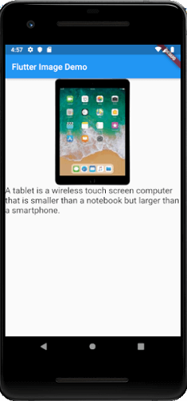

### 2. Hiển thị hình ảnh từ internet
Flutter cung cấp một hàm dựng để tích hợp việc load ảnh từ url, ngoài ra vẫn có thể sử dụng được các thuộc tính khác của Image như width, height, ...
```
Image.network(  
  'https://picsum.photos/250?image=9',  
)  
```

### 3. Hiển thị hình ảnh mờ dần

- Sử dụng ảnh mặc định để hiển thị trong lúc ảnh đang được tải


Hiển thị hình ảnh default từ asset
```
 FadeInImage.assetNetwork(  
                placeholder: 'assets/tablet.png',  
                image: 'https://picsum.photos/250?image=9',  
                  height: 400,  
                  width: 250  
              )
```

Hiển thị hình ảnh default theo dạng bytes
```
 FadeInImage.memoryNetwork(  
                placeholder: kTransparentImage,  
                image: 'https://picsum.photos/250?image=9',  
                height: 400,  
                width: 250  
              )
```

## 6. Flutter Widget: ListTitle(Hai)
- ListTitle là một widget cơ bản mà flutter tạo ra sẵn nhằm phục vụ hiển thị từng row cho thằng ListView, 

- Các thuộc tính của ListTitle:
	- title: Tiêu đề của widget
	- subTitle: Tiêu đề phụ của widget	
	- isThreeLine: Nếu là true thì subTitle phải khác null, nếu false thì máy sẽ không check điều kiện này.
	- onTap: Sự kiện khi người dùng tap vào widget
- Ngoài ra thì nó không thể set được các kích thước, nên mình có thể kết hợp với các widget khác như Container, Card, Column, Row, ListView

// Thêm ảnh

## 7. Center (Anh)
- Một widget trung tâm chỉ đơn giản là tập trung vào `child` bên trong nó. Tất cả các ví dụ trước bao gồm các hàng và cột nằm trong một widget `Center`. Nêú không nằm trong `Center`, nó sẽ dịch chuyển sang trái. Dưới đây là ví dụ:
    - Column không có Center Widget
    

    - Column có Center Widget
    

```
Center(
    child: Column(
      mainAxisAlignment: MainAxisAlignment.spaceEvenly,
      children: <Widget>[
        Text("Element 1"),
        Text("Element 2"),
        Text("Element 3"),
      ],
    ),
  ),
```

- Một widget trung tâm chỉ đơn giản là đưa một đứa trẻ và tập trung nó vào không gian có sẵn

## 8. Media Query
- Nếu bạn đang viết ứng dụng cho cả điện thoại và máy tính bảng. Bạn sẽ muốn có các UI Layout khác nhau cho các kích thước màn hình khác nhau. Kích thước phông chữ lớn hơn hoặc loại bỏ animations cũng có thể thay đổi bố cục

- `Mục đích của Media Query`: Nhờ MediaQuery, bạn có thể nhận được thông tin về kích thước thiết bị bạn đang sử dụng, cũng như tuỳ chọn của người và xây dựng bố cục của bạn cho phù hợp

- Media Query cung cấp chế độ xem cấp cao hơn về kích thước màn hình ứng dụng của bạn và có thể cung cấp thông tin chi tiết hơn về tuỳ chọn bố cục của người dùng

- `Call MediaQuery.of`: truy cập bằng cách gọi MediaQuery.of trong phương thức xây dựng của bạn
```
@override
Widget build(BuildContext context) {
  
  var deviceData = MediaQuery.of(context);

  return Container();
}

```

- Bạn có thể nhận thông tin về kích thước của màn hình bằng cách `.size`. Từ đó bạn có thể tra cứu tất cả các loại thông tin thú vị về thiết bị bạn đang sử dụng, chẳng hạn như kích thước của màn hình và xây dựng bố cục của bạn cho phù hợp, để xác định bố cục tốt nhất

```
@override
Widget build(BuildContext context) {
  var screenSize = MediaQuery.of(context).size;
  if (screenSize.width > 300) {
    //...
  } else {
    // ...
  }

  return Container();
}
```

- Hoặc truy cập hướng thiết bị bằng cách `.orientation` .  `Media Query` cũng pho phép bạn kiểm tra hướng thiết bị của mình
```
@override
  Widget build(BuildContext context) {
    var deviceOrientation = MediaQuery.of(context).orientation;

    return Container();
  }
```

- Hoặc font size bằng cách `.textScaleFactor`. Nó xác định xem người dùng đã sửa đổi font size mặc định hay chưa
```
@override
  Widget build(BuildContext context) {
    var fontScaling = MediaQuery.of(context).textScaleFactor;

    return Container();
  }
```

- Hoặc screen occlution bằng cách `.padding`. Bạn có thể kiểm tra các phần của màn hình bị khuất bởi các giao diện người dùng hệ thống giống như tiện ích khu vực an toàn cấp thấp hơn
```
@override
  Widget build(BuildContext context) {
    var notchInset = MediaQuery.of(context).padding;

    return Container();
  }
```

- Hoặc tuỳ chọn animation `.disableAnimations` hoặc độ tương phản màn hình `.platformBrightness`. Bạn có thể tra cứu thông tin trợ năng thú vị, chẳng hạn như thiết bị đang yêu cầu bạn giới hạn animation hay mức độ tương phản màn hình(screen contrast)

```
@override
  Widget build(BuildContext context) {
    var noAnimations = MediaQuery.of(context).disableAnimations;

    return Container();
  }
```

```
@override
  Widget build(BuildContext context) {
    var screenContrast = MediaQuery.of(context).platformBrightness;

    return Container();
  }
```

## 9. Flutter Widget: Padding(An)

Là một widget bao bọc các widget khác để cung cấp cho chúng phần padding theo tất cả hoặc các hướng được chỉ định. 

``` dart
    Padding({Key? key, required EdgeInsetsGeometry padding, Widget? child})
```

- `child` Widget được bao bọc.
- `padding` Là thuộc tính bắt buộc dùng để chỉ định hướng cũng như giá trị inset so với widget cha.

``` dart
const Card(
  child: Padding(
    padding: EdgeInsets.all(16.0),
    child: Text('Hello World!'),
  ),
)
```
Cung cung cấp cho widget văn bản một phần đệm inset 16.0px theo mọi hướng.

## 10. Flutter Widget: Spacer(An)
``` dart
Spacer({Key? key, int flex})
```

Spacer tạo ra một khoảng không gian trống, có thể điều chỉnh được, được sử dụng để điều chỉnh khoảng cách giữa các Widget con bên trong một bộ chứa Flex (Flex container) như Column, Row, ..

``` dart
Row(
  children: const <Widget>[
    Text('Begin'),
    Spacer(), // Defaults to a flex of one.
    Text('Middle'),
    // Gives twice the space between Middle and End than Begin and Middle.
    Spacer(flex: 2),
    Text('End'),
  ],
)
```

``` dart
SizedBox(
    height: 50,
    child: Row(
      children: <Widget>[
        Container(
          width: 50,
          color: Colors.red,
        ),
        Spacer(flex: 3),
        Container(
          width: 50,
          color: Colors.green,
        ),
        Spacer(flex: 1),
        Container(
          width: 50,
          color: Colors.blue,
        ),
        Spacer(),     // Mặt định sẽ là 1
        Container(
          width: 50,
          color: Colors.yellow,
        ),
      ],
    ),
  )
```

- Ở đoạn code trên khoảng trống còn lại ở trong row sẽ đc chia thành 5 phần và chia theo flex của space, từ đó xác định đc khoảng trống.

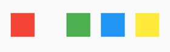 

## 11. Flutter Widget: Expanded ( Hạnh )

- Expanded là gì?
  - Expanded là một widget giúp mở rộng không gian cho một widget con của Row hoặc Column theo trục chính (main axis). Chú ý, trục chính của Row là trục nằm ngang,     và trục chính của Column là trục thẳng đứng.

	```
	 Row(
	  children: [
	    Expanded(
	      child: Container(
	          color: Colors.blue,
	          height: 70,
	        ),
	    ),
	    Expanded(
	      child: Container(
	        color: Colors.black,
	        height: 70,
	      ),
	    ),
	    Expanded(
	      child: Container(
	        color: Colors.red,
	        height: 70,
	      ),
	    ),
	  ],
	),
	```

  - Ở ví dụ trên theo như chúng ta thấy thì nó sẽ được kết quá như thế này.
  
    

   
  - và tôi muốn rằng những ô của tôi sẽ được cách ra một khoảng như ý muốn của tôi
    
    ```javascript
        Row(
          children: [
       Expanded(
              flex: 1,
              child: Container(
                  color: Colors.blue,
                  height: 70,
                ),
            ),
            Expanded(
              flex: 2,
              child: Container(
                color: Colors.black,
                height: 70,
              ),
            ),
            Expanded(
              flex: 3,
              child: Container(
                color: Colors.red,
                height: 70,
              ),
            ),
           ],
        ),
    ```
   - Ở ví dụ trên thì theo như ta thấy ứng với những **flex: 1,**, **flex: 2,*, **flex: 3,** thì ta có **flex: 2,** sẽ gấp đôi **flex: 1,** và **flex: 3,** sẽ gấp 3 lần **flex: 1,**, cùng xem kết quả 

     
    
   - **Vậy tại sao lại sử dụng Expanded?** Vì chúng ta muốn thay đổi các widget con của mình theo kích thước mà mình mong muôn, không muốn nó bằng nhau hoặc không muốn nó mặc định như 
     
    ```
       Row(
          children: [
            Container(
              color: Colors.black,
              height: 70,
              width: 70,
            ),
            Expanded(
              child: Container(
                  color: Colors.blue,
                  height: 70,
                ),
            ),
            Container(
              color: Colors.red,
              height: 70,
              width: 70,
            ),
          ],
        ),
    ```
  

## 12. Flutter Widget: Flexible (A.Thịnh)

## 13. Flutter Widget: Stack (A.Thịnh)

## 14. Flutter Widget: Divider(Hải)

- Divider là widget với dải phân cách ngang

```
Column(children: [
          BluxBox(),
          Divider(),
          RedBox(),
        ])
```

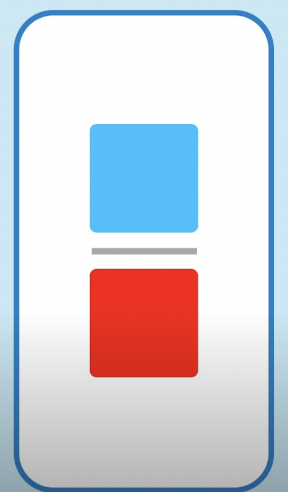

- Chúng ta có thể tăng khoảng cách, độ dày hoặc màu sắc của devider bằng cách chỉnh sửa các thuộc tính như sau:

```
\\
Divider(
        height: 100, 
        thickness: 20, 
        color: Colors.accents,
        indent: 20 // padding left
        endIndent: 20 // padding right)
\\
```

- Trong trường hợp chúng ta muốn quy định sẵn ngăn cách cho mỗi widget là một divider thì ta có thể sử dụng luôn DividerThemeData cho MasterialApp

```
DividerThemeData(
                space: 100, 
                thickness: 20, 
                color: Colors.accents,
                indent: 20
                endIndent: 20),
```
> **height** trở thành **space**

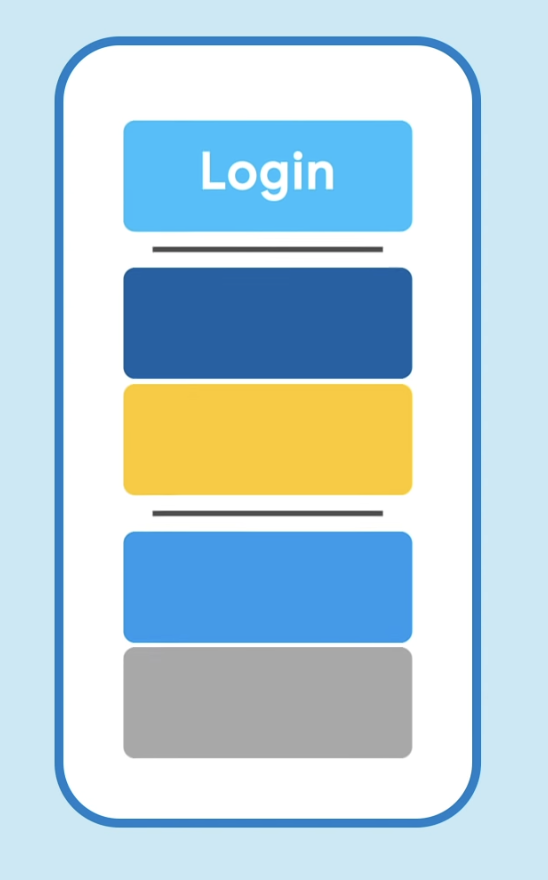


- Ngoài ra thì divider còn được tích hợp ở trong ListView sẵn bằng các hàm dựng đặc biệt

```
ListView.separated(separatorBuilder: (context, index) {
          return Divider(thickness: 10, height: 0,);
        })
```

or

```
ListView(
  children: ListTile.divideTiles(
    context: context,
    tiles: [
      // your widgets here
    ]
  ).toList(),
)

```

## 15. Flutter Widget: Table(Hải)

- Table cho phép người dùng sắp xếp dữ liệu theo hàng và cột. Nó được sử dụng để hiển thị dữ liệu của chúng ta ở định dạng có cấu trúc, giúp chúng ta có thể so sánh các cặp giá trị có liên quan một cách dễ dàng. Table widget này có các thuộc tính để tuỳ chỉnh chế độ hiển thị: border, children, columnWidths, textDirection, textBaseline, v.v.

P/s: Widget này không hỗ trợ scroll

```
Table(  
    defaultColumnWidth: FixedColumnWidth(120.0),  
    border: TableBorder.all(  
        color: Colors.black,  
        style: BorderStyle.solid,  
        width: 2),  
    children: [  
      TableRow( children: [  
        Column(children:[Text('Website', style: TextStyle(fontSize: 20.0))]),  
        Column(children:[Text('Tutorial', style: TextStyle(fontSize: 20.0))]),  
        Column(children:[Text('Review', style: TextStyle(fontSize: 20.0))]),  
      ]),  
      TableRow( children: [  
        Column(children:[Text('Javatpoint')]),  
        Column(children:[Text('Flutter')]),  
        Column(children:[Text('5*')]),  
      ]),  
      TableRow( children: [  
        Column(children:[Text('Javatpoint')]),  
        Column(children:[Text('MySQL')]),  
        Column(children:[Text('5*')]),  
      ]),  
      TableRow( children: [  
        Column(children:[Text('Javatpoint')]),  
        Column(children:[Text('ReactJS')]),  
        Column(children:[Text('5*')]),  
      ]),  
    ],  
  )
```

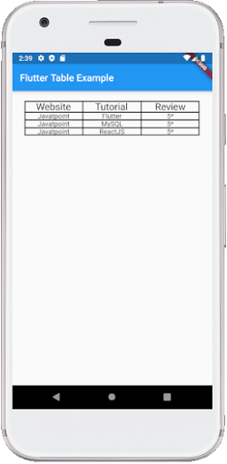

**Trong khi sử dụng widget này, chúng ta phải biết các quy tắc sau:**

- Widget này tự động quyết định chiều rộng cột, được chia đều cho các TableCell. 
- Nếu nó không bằng nhau, chúng ta sẽ gặp lỗi cho biết mọi TableRow trong bảng phải có cùng số con để mọi ô đều được lấp đầy. Nếu không, bảng sẽ chứa các lỗ.
- Mỗi hàng có cùng chiều cao, sẽ bằng chiều cao nhất của TableCell.
- Các con của một bảng chỉ có thể có các widget TableRow.


// Tim hieu cols, rows
## 16. ConstrainedBox(An)
Đây là một widget cho phép bạn buộc các ràng buộc bổ sung lên widget con của nó. Nó có nghĩa là bạn có thể buộc widget con có một ràng buộc cụ thể mà không làm thay đổi các thuộc tính của widget con.

Ví dụ: nếu bạn muốn con có chiều cao tối thiểu là 50.0 pixel logic, bạn có thể sử dụng const BoxConstraints (minHeight: 50.0) làm ràng buộc.

### Constructors:
``` dart
ConstrainedBox({Key? key, required BoxConstraints constraints, Widget? child})
```

Code ví dụ:
``` dart
ConstrainedBox(  
  constraints: new BoxConstraints(  
    minHeight: 50.0,  
    minWidth: 150.0,  
    maxHeight: 300.0,  
    maxWidth: 300.0,  
  ),  
  child: new DecoratedBox(  
    decoration: new BoxDecoration(color: Colors.red),  
  ),  
),  
```

## 17. IndexedStack(An)

Ngăn xếp hiển thị một widget từ danh sách các widgets đã khai báo. Widget được hiển thị theo chỉ số index cho trước. Nếu giá trị children là null, thì không có gì được hiển thị.

### Constructors:
``` dart
IndexedStack({
  Key? key, 
  AlignmentGeometry alignment = AlignmentDirectional.topStart, //Sử dụng để căn chỉnh các widget con khác Positioned. Giá trị mặc định của nó là AlignmentDirectional.topStart
  TextDirection? textDirection, //Để setup hướng của văn bản, giá trị của nó sẽ ảnh hưởng tới hành vi của property alignment.
  StackFit sizing = StackFit.loose, 
  int? index,       //Chỉ số của widget con sẽ được hiển thị, giá trị mặc định của nó là 0. Nếu giá trị của index là null sẽ không có widget con nào được hiển thị.
  List<Widget> children = const <Widget>[] //à một danh sách các widget con của IndexedStack
})
```

`StackFit sizing = StackFit.loose` Nó chỉ ra cách "Làm thế nào để định kích thước cho các widget con khác Positioned của IndexedStack". Giá trị mặc định của property fit là StackFit.loose.

Ví dụ:
``` dart
 IndexedStack (
    alignment: Alignment.center,
    index: this.selectedIndex,
    children: <Widget>[
      Container(
        width: 290,
        height: 210,
        color: Colors.green,
    ),
    Container(
      width: 250,
      height: 170,
      color: Colors.red,
    ),
    Container(
      width: 220,
      height: 150,
      color: Colors.yellow,
    ),
    ]
  ),
```
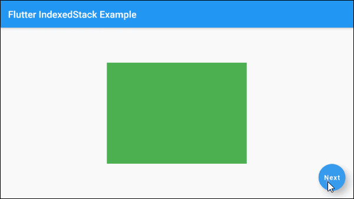

## 18. Flutter Widget: FittedBox (Anh)

- `FittedBox`: Cân và định vị child của nó trong chính nó một cách phù hợp

- Properties trong `FittedBox`:
    - `child`: Là widget con
    - `Alignment`: Đặt child nằm trong giới hạn của widget cha
    - `clipBehavior`: Nội dung sẽ bị cắt bớt cho phù hợp
    - `fit`: Đặt child vào không gian được phân bổ trong quá trình bố trí
    
- Example:

```
class MyApp extends StatelessWidget {
  const MyApp({Key? key}) : super(key: key);

  @override
  Widget build(BuildContext context) {
    return MaterialApp(
      home: SafeArea(
        child: DemoFittedBox(),
      ),
    );
  }

class DemoFittedBox extends StatelessWidget {
  const DemoFittedBox({Key? key}) : super(key: key);

  @override
  Widget build(BuildContext context) {
    return Center(
      child: Container(
        height: 400,
        width: 300,
        color: Colors.red,
        child: FittedBox(
          child: Image.network(
              'https://flutter.github.io/assets-for-api-docs/assets/widgets/owl-2.jpg'),
          fit: BoxFit.fill,
        ),
      ),
    );
  }
}
```

- Kết quả: 
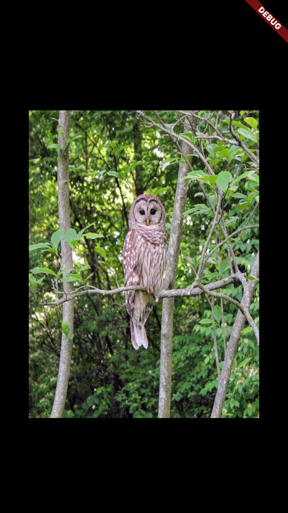


## 19. Flutter Widget: LimitedBox (Hải)

- LimitedBox là một widget trong Flutter, giúp tạo ra 1 cái hộp hạn chế kích thước của các con bên trong nó nếu nó không bị ràng buộc bởi cha mẹ của nó.

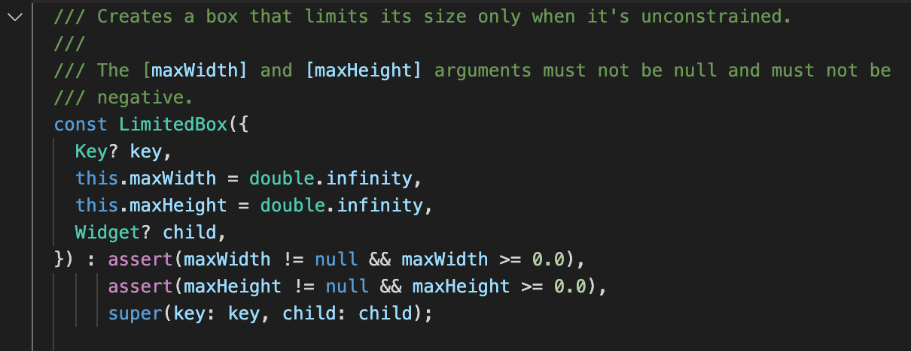

LimitedBox có 2 thuộc tính là `maxWidth` và `maxHeight`, với kiểu dữ liệu là double và giá trị mặc định sẽ là double.infinity. Những giá trị đó được sử dụng để đặt giới hạn chiều rộng và chiều cao tối đa. maxWidth chỉ được sử dụng khi BoxConstraints.maxWidth vắng mặt, trong khi maxHeight chỉ được sử dụng khi BoxConstraints.maxHeight vắng mặt. Bạn có thể chuyển các thuộc tính đó trong hàm tạo. Các giá trị đó không được `null` hoặc `âm` để tránh lỗi.

**Ví dụ**
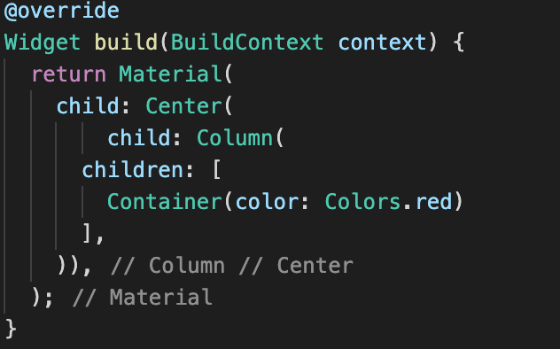
**Output:**
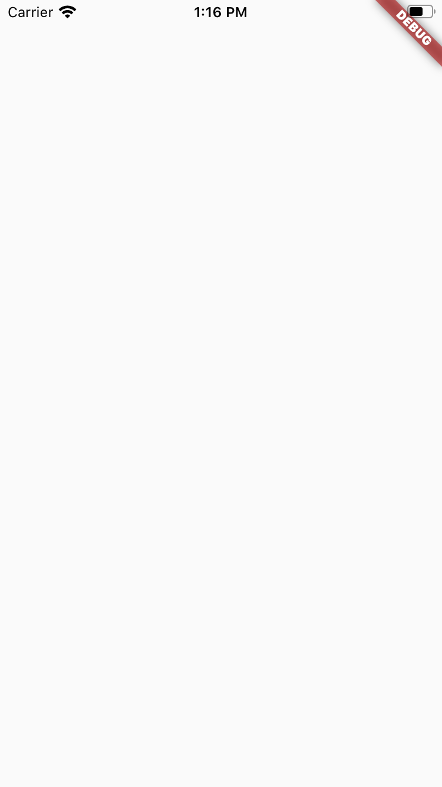

Bây giờ chúng ta hay thêm LimitedBox vào

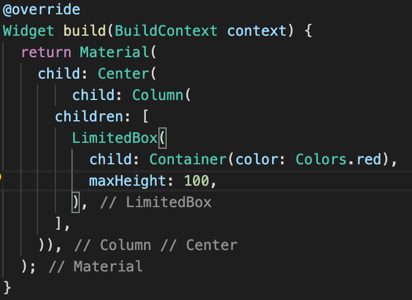
**Output:** 
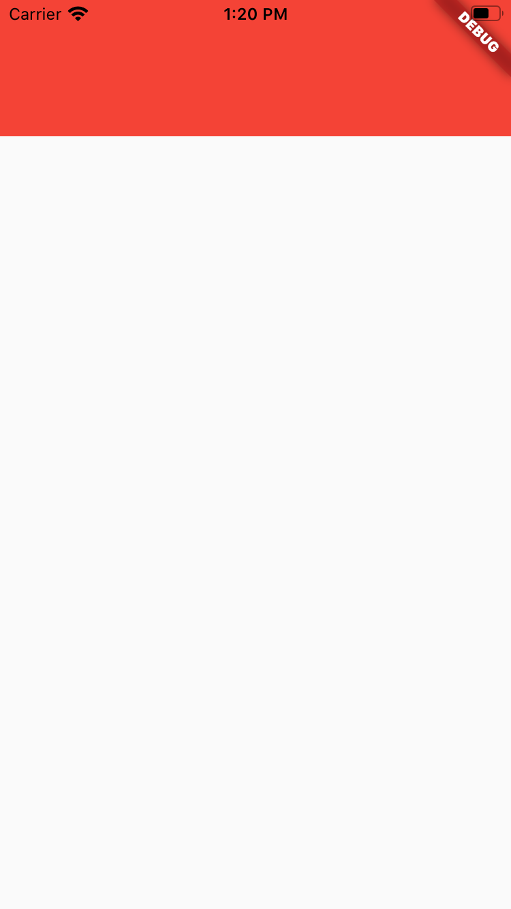

**Container lúc này sẽ có kích thước chiều cao là 100**

Trong trường hợp LimitedBox đang bị giới hạn ràng buộc bởi cha của nó là container(w: 200, h: 300)
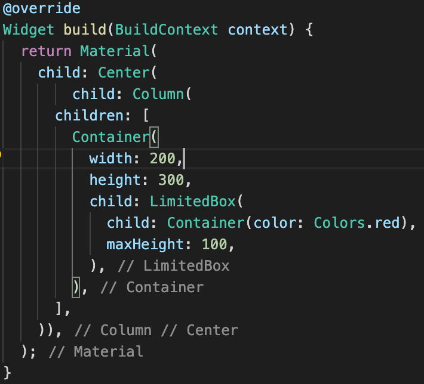
**Output:**
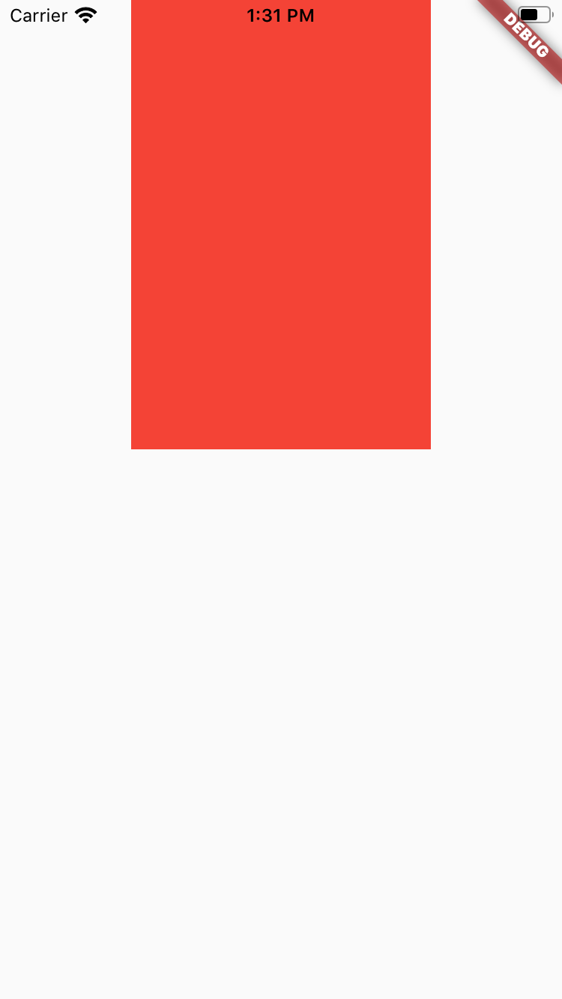

Thì chúng ta có thể sử dụng **UnconstrainedBox** để loại bỏ điều này.
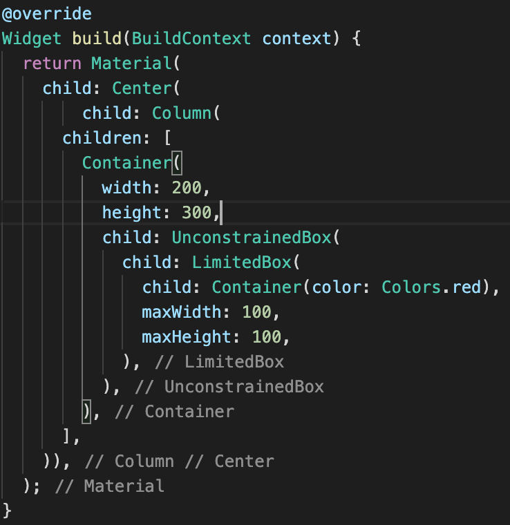
**Output:**


**P/s: Khi cha mẹ của LimitedBox bị giới hạn kích thước thì LimitedBox không thể kích hoạt.**

- Bạn cần hiểu hành vi của thành phần cha. Ví dụ: nếu bạn sử dụng Container không có width và height, container này sẽ nhận các ràng buộc từ cha mẹ sang truyền sang, có nghĩa là nó bị ràng buộc và LimitedBox sẽ không hoạt động như mong đợi.

## 20. Flutter Widget: Simple Custom Widget (Hải)

**Custom Widget là gì?**
- Tạo ra widget mới của riêng mình từ những widget đã có sẵn trong flutter và có thể được sử dụng ở nhiều nơi.

**Problem: Mình có 2 màn hình Login và Register, cả 2 màn hình này đều có 2 button giống nhau về màu sắc, góc. Làm sao để có thể tạo một lần và sử dụng được cho 2 màn hình?**
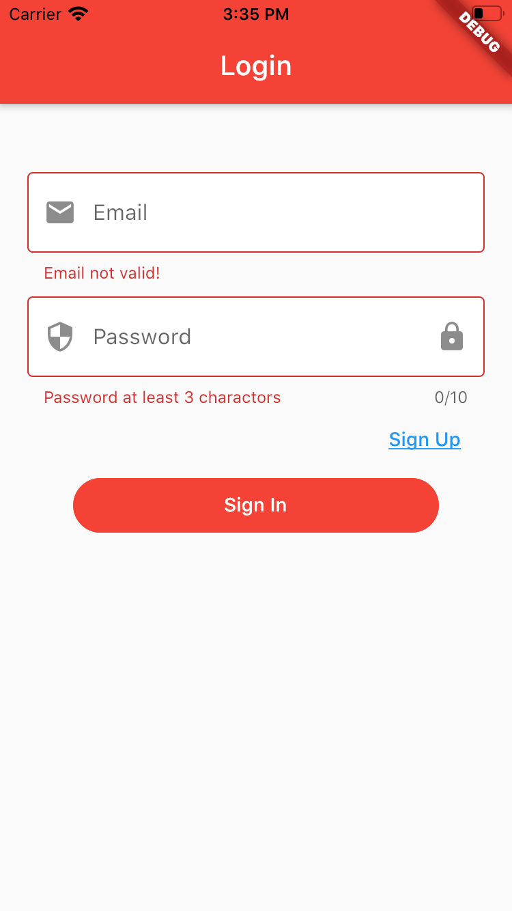

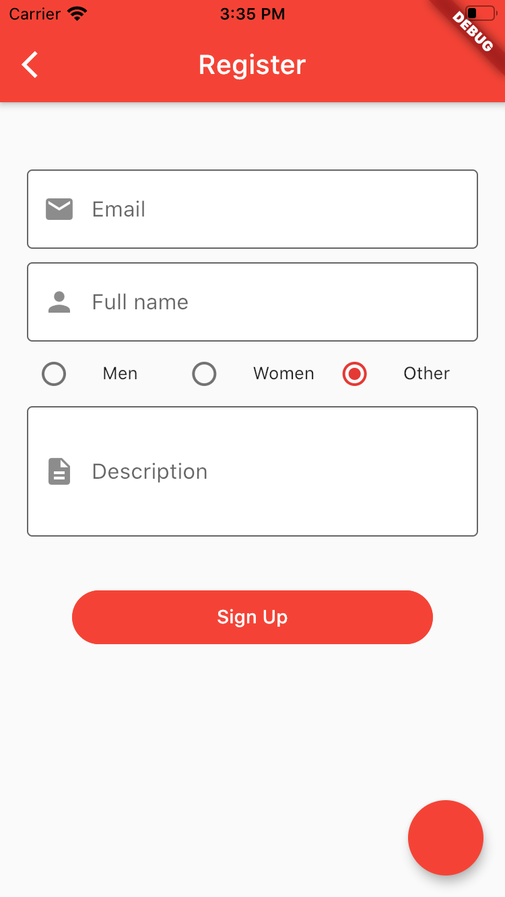

Ở đây thì chúng ta sẽ tạo ra

**MyThemeButton**
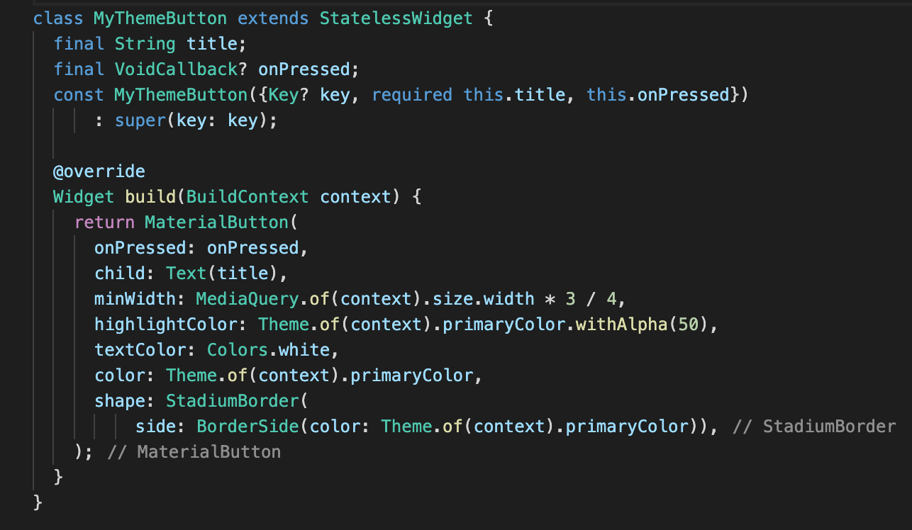

**Login screen**

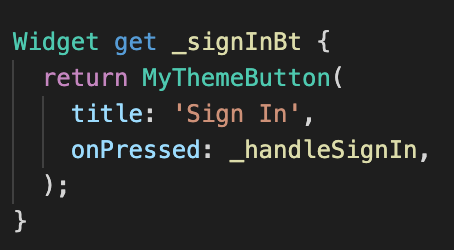

**Register screen**

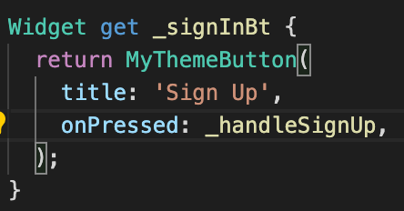

**Các bước xây dựng Widget của riêng mình**
- Xác định giao diện, nhiệm vụ của Widget mình muốn custom
- Xác định các config dành cho widget(ví dụ ở MH login thì Text sẽ màu đỏ, còn ở MH register Text màu cam, bước này có thể thực hiện liên tục)
- Xác định các callback function để phản hồi về nơi sử dụng
- Cuối cùng, thực hiện custom


**Ưu điểm của việc Custom Widget:**
  
  1. Đóng gói dữ liệu - Encapsuation
	 + Tránh sự soi mói    
	 + Tránh thay đổi ngoài ý muốn 
	
  2. Tái sử dụng - Reuse
	  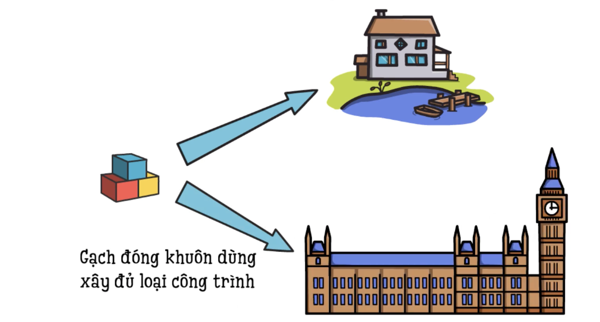

  3. Tham số hoá - Parameterized
  	  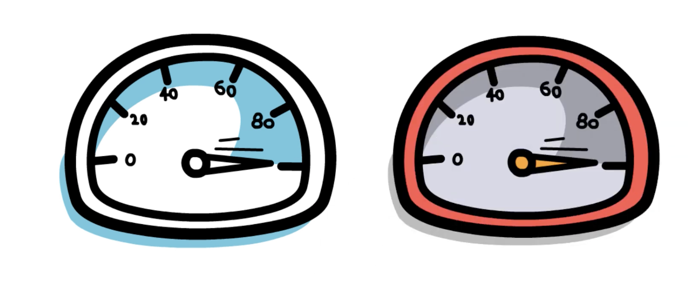


## 21. Flutter Widget: RichText (A.Thịnh)

- RichText dùng để hiển thị 1 văn bản text với nhiều style khác nhau, mỗi text con được biểu diễn bởi 1 TextSpan. Văn bản có thể ở trên 1 dòng hoặc nhiều dòng phụ thuộc vào các bạn thiết lập cho nó. Mỗi Text hiển thị trong Rich Text phải có 1 style rõ ràng, style của nó sử dụng TextStyle tương tự như textStyle của Text. Style mặc định cho nó sẽ là `DefaultTextStyle.of(context).style`

```
RichText({
    Key? key,
    required this.text,
    this.textAlign = TextAlign.start, // Căn chỉnh text theo chiều ngang
    this.textDirection, // [Định hướng văn bản](https://api.flutter.dev/flutter/dart-ui/TextDirection-class.html) 
    this.softWrap = true, // Ngắt dòng, nếu false thì sẽ có chiều ngang không giới hạn
    this.overflow = TextOverflow.clip, // Có 4 options để xử lý khi tràn viền
    this.textScaleFactor = 1.0, // Số lượng font pixel cho mỗi logical pixel, nếu scale là 1.5 thì văn bản sẽ lớn hơn 50% so với kích thước phông chỉ định
    this.maxLines, // Số dòng tối đa trong văn bản
    this.locale, // Được sử dụng để chọn 1 font chữ khi bị trùng kí tự unicode
    this.strutStyle, // Xác định thanh chống, thiết lập chiều cao tối thiểu mà một đường có thể so với đường cơ sở.
    this.textWidthBasis = TextWidthBasis.parent, // Xác định cách để đo chiều rộng của một hoặc nhiều dòng
    this.textHeightBehavior, // Xác định cách áp dụng TextStyle.height trên và dưới văn bản.
  })
```

```
const TextSpan({
    this.text, // Text hiển thị
    this.children, // Một danh sách text span
    TextStyle? style, // Style cho text trong span
    this.recognizer, // Các sự kiện tương tác
    MouseCursor? mouseCursor, // // web
    this.onEnter, // web
    this.onExit, // web
    this.semanticsLabel, // cũng cấp ý nghĩa của widget
  })
```

**Ví dụ:** 
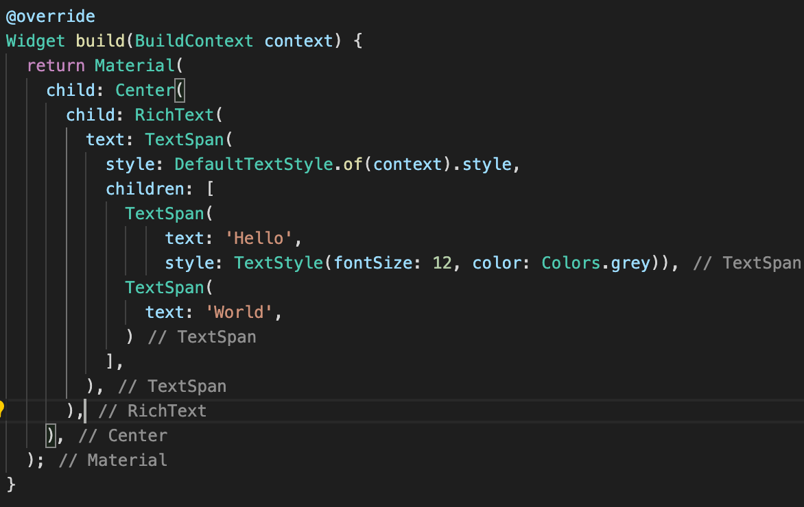
**Output:**
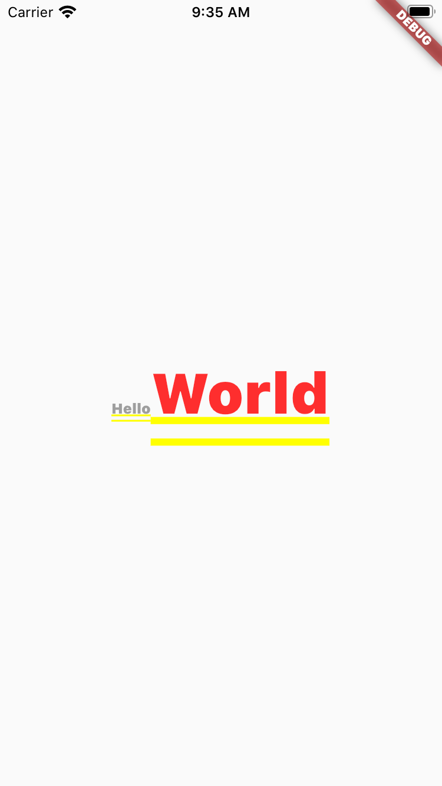

Ngoài ra mình có thể thêm các sự kiện tap vào như

```
//
TextSpan(
            text: 'World',
            recognizer: TapGestureRecognizer()
              ..onTap = () {
                print('World');
              },
          )
\\
```

## 22. Flutter Widget: SelectableText (A.Thịnh)


## 23. Flutter Widget: Safe Area (Anh)

- `Safe area`: được dịch gọi là một khu vực an toàn

- Example 1:

+ Ta có một đoạn code không sử dụng Safe area:

```
@override
Widget build(BuildContext context) {
  return MaterialApp(
    home: DemoSafeArea(),
  );
}

class DemoSafeArea extends StatelessWidget {
  const DemoSafeArea({Key? key}) : super(key: key);

  @override
  Widget build(BuildContext context) {
    return Scaffold(
      body: Text('Hello world'),
    );
  }
}

```

+ Kết quả:

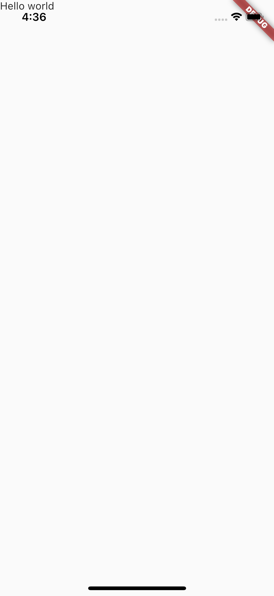


- Example 2:

+ Ta có một đoạn code sử dụng Safe Area

```
@override
Widget build(BuildContext context) {
  return MaterialApp(
    home: DemoSafeArea(),
  );
}

class DemoSafeArea extends StatelessWidget {
  const DemoSafeArea({Key? key}) : super(key: key);

  @override
  Widget build(BuildContext context) {
    return SafeArea(
      child: Scaffold(
        body: Text('Hello world'),
      ),
    );
  }
}
```

- Kết quả:

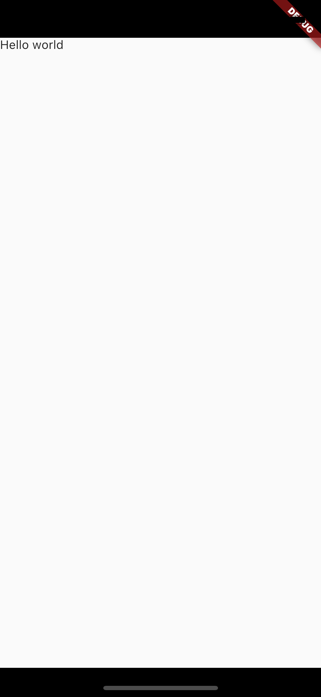

- Các thuộc tính có trong wiget Safe Area:
    - `bottom -> bool`: Thuộc tính này thuộc loại bool. Theo mặc định, nó là true và đặt nó thành false thì sẽ vô hiệu hoá SafeArea thêm phần padding vào cuối màn hình
    - `top -> bool`: Thuộc tính này cũng thuộc loại bool và đặt nó thành false sẽ tránh được padding ở đầu màn hình
    - `left -> bool`: Thuộc tính này cũng thuộc loại bool và đặt nó thành false sẽ tránh được padding ở bên trái màn hình
    - `right -> bool`: Thuộc tính này cũng thuộc loại bool và đặt nó thành false sẽ tránh được padding ở bên phải màn hình
    - `minimum -> EdgeInsets`: Thuộc tính này thuộc loại EdgeInsets. Bạn có thể chỉ định padding tối thiểu được thêm vào bằng cách sử dụng thuộc tính này.
    - `maintainBottomViewPadding -> bool`: Chỉ định liệu SafeArea có nên duy trì MediaQueryData.viewPadding thay vì MediaQueryData.padding khi được sử dụng bởi MediaQueryData.viewInsets của MediaQuery trong ngữ cảnh hiện tại hay không, mặc định là false. [...]


## 24. Flutter Widget: Wrap(Anh)

- `Wrap`: là một widget hiển thị các con của nó theo nhiều chiều ngang hoặc dọc

- Cũng tương tự như `Row` và `Column`, nhưng mà khi các child con trong `Row` và `Column` vượt quá kích thức màn hình thì nó sẽ báo lỗi. Chúng ta xem ở ví dụ sau:

```
class MyApp extends StatelessWidget {
  const MyApp({Key? key}) : super(key: key);

  @override
  Widget build(BuildContext context) {
    return MaterialApp(
      home: Scaffold(
        body: Center(
          child: Container(
            color: Colors.red,
            width: 300,
            height: 400,
            child: Row(
              children: [
                Container(
                  color: Colors.blue,
                  width: 70,
                  height: 40,
                ),
                Container(
                  color: Colors.grey,
                  width: 70,
                  height: 40,
                ),
                Container(
                  color: Colors.greenAccent,
                  width: 70,
                  height: 40,
                ),
                Container(
                  color: Colors.yellow,
                  width: 70,
                  height: 40,
                ),
                Container(
                  color: Colors.pink,
                  width: 70,
                  height: 40,
                ),
              ],
            ),
          ),
        ),
      ),
    );
  }
}

```

- Kết quả sẽ báo lỗi trên màn hình như sau:
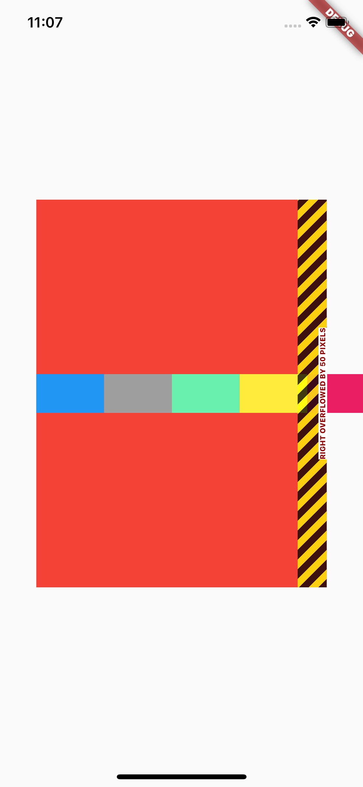

- Nhưng khi ta dùng với `Wrap` thì nó sẽ không bị lỗi, và tự động sắp xếp child bên trong phù hợp. Chúng ta xem ví dụ sau, đổi `Row` thành `Wrap`:

```
class MyApp extends StatelessWidget {
  const MyApp({Key? key}) : super(key: key);

  @override
  Widget build(BuildContext context) {
    return MaterialApp(
      home: Scaffold(
        body: Center(
          child: Container(
            color: Colors.red,
            width: 300,
            height: 400,
            child: Wrap(
              children: [
                Container(
                  color: Colors.blue,
                  width: 70,
                  height: 40,
                ),
                Container(
                  color: Colors.grey,
                  width: 70,
                  height: 40,
                ),
                Container(
                  color: Colors.greenAccent,
                  width: 70,
                  height: 40,
                ),
                Container(
                  color: Colors.yellow,
                  width: 70,
                  height: 40,
                ),
                Container(
                  color: Colors.pink,
                  width: 70,
                  height: 40,
                ),
              ],
            ),
          ),
        ),
      ),
    );
  }
}


```

- Kết quả thật tuyệt vời khi dùng `Wrap`:
-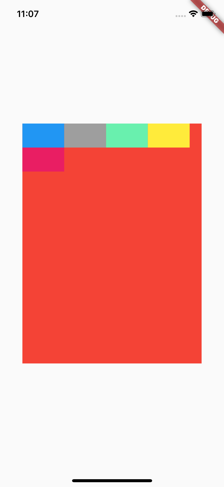

- Các thuộc tính có trong `Wrap`, nó có một vài thuộc tính tương tự như `Row` và `Column`:
    - `direction`: Theo mặc định, trục nằm ngang những chúng ta có thể cho nó thẳng đứng bằng cách thay đổi trục từ `Axis.horizontal` thành `Axis.vertical`
    - `crossAxisAlignment`: Cái này thì tương tự như `Row` và `Column` thì nó sắp xếp các widget con theo trục chéo
    - `alignment`: Chúng ta có thể đặt thuộc tính căn chỉnh để căn chỉnh các widget con. Ví dụ: `alignment: WrapAlignment.center`
    - `runAlignment`: Thuộc tính này thì nó giống `crossAxisAlignment` của `Row` và `Column`. Nó cho phép căn chỉnh các widget con theo trục chéo. Theo mặc định thì `runAlignment` được đặt là `WrapAlignment.start`
    - `spacing`: Khoảng trống giữa các widget con
    - `runSpacing`: Khoảng trống giữa các widget con theo trục chéo
    - `textDirection`: Giống như ở `Row` thì nó sắp xếp thứ tự các widget con theo chiều ngang. Ví dụ: `textDirection: TextDirection.rtl` để sắp xếp từ phải sang trái
    - `verticalDirection`: Giống như `Column` thì nó sắp xếp thứ tự các widget con theo chiều dọc. Ví dụ: `verticalDirection: VerticalDirection.up` để sắp xếp từ dưới lên
    - `clipBehavior`: Nội dung bên trong sẽ được cắt bớt theo tuỳ chọn này
## 25. Slider(An)
Được sử dụng để chọn giá trị từ một khoảng range giá trị.

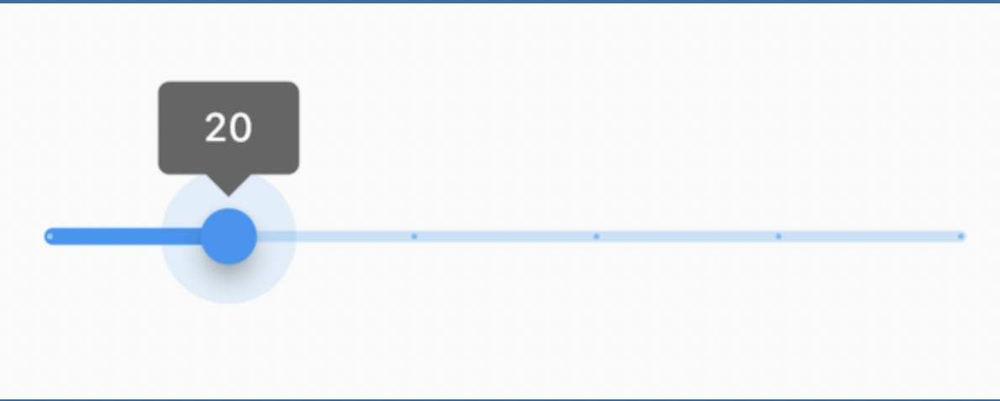

``` dart
Slider(
  value: _currentSliderValue,
  min: 0,
  max: 100,
  divisions: 5,     // Khoảng giá trị step
  label: _currentSliderValue.round().toString(),
  onChanged: (double value) {
    setState(() {
      _currentSliderValue = value;
    });
  }
)
```
Ngoài ra ta có thể thay đổi màu, bắt sự kiện khi bắt đầu chọn hay đã chọn xong giá trị mới,...


## 26. Flutter Widget: ListView(Hanh)
  - ListView chia ra làm 4 phần:
    - ListView
      - Đây là phần cơ bản nhất của một ListView. ListView cho ra một danh sách widget con (children).
        ```javascript
          child: ListView(
            children: [
              Container(...),
                informationWidget(context: context),
                postImgaeUser(context: context, postImage: postUserModel.images),
                assessAndEmotion(),
                statusWidget(status: postUserModel.contents.toString()),
                viewCommentWidget(),
                commentMeWidget(),
             ],
          ),
        ```
      - Đây là một ví dụ của ListView.  
        
      - Một số Properties cơ bản của ListView
    
        - ScrollDiretion.
          - **ScrollDiretion:** Giúp các widget con của ListView có thể scroll ngang dọc theo **Axis.horizontal** và **Axis.vertical**
          
            
          
        - Reverse
          - Giúp các widget con của ListView có thể đảo ngược reverse có kiểu dữ liệu là bool
        
            
          
        - Physics
          - Nếu giữ liệu widget con của ListView không vượt quá giới hạn cho phép của một màn hình, thì hãy nghĩ đến việc không cho nó scroll bằng cách.
            **NeverScrollableScrollPhysics()**
    - ListView.builder
      - ListView.builder: có hàm khởi tạo builder cho phép chúng ta có thể xây dựng một danh sách lặp lại các item,
      - ListView.builder sẽ nhận hai tham số chính.
        - itemCount: đại diện cho số lượng item.
        - itemBuilder: đại diện cho từng mục hiển thị trong danh sách
        ```javascript
           child: ListView.builder(
            itemCount: viewModel.postUserList.length,
            itemBuilder: (BuildContext context, int index) {
              return postWidget(
                  profileImage: "assets/images/hanhnguyen.jpeg",
                  name: user!.name,
                  status: viewModel.postUserList[index].contents ?? "",
                  postImage: viewModel.postUserList[index].images,
                  likes: "999 Likes this",
                  time: "9 min",
                  context: context,
                  onTap: _onchanged,
                  onTapPostUser: () {
                    var route =  MaterialPageRoute(builder: (context) => NewsDetialScreen(postUserModel: viewModel.postUserList[index],));
                    Navigator.push(context, route);
                  });
            }
          )
        ```
        - Hình ảnh cho ví dụ của **ListView.builder**
        
          
        
     - ListView.separated
       - Với hàm tạo separated thì chúng ta có thể tạo ra một list các item hiển thị ngăn cách với nhau, sẽ có 3 tham số chính itemCount, itemBuilder và  separatorBuilder

         ```javascript
            child: ListView.separated(
            physics: BouncingScrollPhysics(),
            separatorBuilder: (BuildContext context, int index) {
              return Container (
                height: 10,
                color: Colors.black26,
              );
            },
            itemCount: viewModel.postUserList.length,
            itemBuilder: (BuildContext context, int index) {
              return postWidget(
                  profileImage: "assets/images/hanhnguyen.jpeg",
                  name: user!.name,
                  status: viewModel.postUserList[index].contents ?? "",
                  postImage: viewModel.postUserList[index].images,
                  likes: "999 Likes this",
                  time: "9 min",
                  context: context,
                  onTap: _onchanged,
                  onTapPostUser: () {
                    var route =  MaterialPageRoute(builder: (context) => NewsDetialScreen(postUserModel: viewModel.postUserList[index],));
                    Navigator.push(context, route);
                  });
            }
          )
         ```

       - Hình ảnh của ListView.separated         
         
         

     - ListView.custom
       - Hàm khởi tạo **custom()** đúng như tên gọi của nó cho phép chúng ta tạo ListView với chức năng tùy chỉnh về cách tạo các item của list. Các tham số chính cần thiết là: chidrenDelegate

         ```javascript
              ListView.custom(
              childrenDelegate: SliverChildBuilderDelegate(
                  (BuildContext context, int index) {
                return ListItemWidget(
                    context: context,
                    images: viewModel.userPosts[index].urlImage,
                    status: viewModel.userPosts[index].status,
                    datePost: viewModel.userPosts[index].datePost,
                    timePost: viewModel.userPosts[index].timePost,
                    userPost: viewModel.userPosts[index],
                  );
                },
                childCount: viewModel.userPosts.length,
            ),
          ),   
         ```

        - Hình ảnh của **ListView.custom**
        
          


## 27. Flutter Widget: AnimatedList(Hanh)
- AnimatedList:
    - Nếu ứng dụng của bạn được xây dựng xung quanh một danh sách động, các mục luôn được thêm, bớt hoặc thay đổi một cách có hệ thống. Nhưng nếu không có animation sẽ gây ra sự khó hiểu với người dùng AnimatedList sẽ giúp chung ta giải quyết vấn đề trên
    - Video ở dưới sẽ giúp chúng ta hiểu hơn về nó 
      
      
      
    - Properties
      - InitiaLItemCount vs ItemBuilder là hai properties chính của AnimatedList
        - InitiaLltemCount: giúp chúng ta biết được là số lượng item trong một List các danh sách của mình.
        - ItemBuilder: Đây là hàm sẽ được gọi cho từng item một trong danh sách.
      - Đoạn code ví dụ:

        ```javascript
           AnimatedList(
            padding: EdgeInsets.all(16),
            key: listKey,
            initialItemCount: viewModel.userPosts.length,
            itemBuilder: (context, index, animation) {
              return buildItem(
                viewModel.userPosts[index],
                index, animation,
              );
            }
          ),
        ```

       - Đây là hình ảnh của ví dụ trên:
         
         
         
    - Trông nó khá giống với Lisview.buider vậy điểm khác biệt của nó là gì?. À AnimatedList nó hộ trợ chúng ra có một dánh sách động tức là có thể xoá, hoặc thêm vào bắt đầu thôi nào
      - RemoveItem
        - Bước 1: Để có thể remove item được thì phải gọi phương thức **AnimatedListState**

          ```
             final listKey = GlobalKey<AnimatedListState>();          
          ```

        - Bước 2: Gán key của nó vào properties **key**

          ```
             child: AnimatedList(
                 padding: EdgeInsets.all(16),
                 key: listKey,          
          ```

        - Bước 3: Tạo hàm remove item.

          ```
             void removeItem(int index) {
             final item = viewModel.userPosts.removeAt(index);
             listKey.currentState!.removeItem(
              index,
              (context, animation) => buildItem(item, index, animation,),
             );
            }
          ```

        - Bước 4: cho hàm **removeItem** vào đúng cái chỗ mình muốn click

          ```
             onClicked: () => removeItem(index),
          ```

        - Và sau đó chúng ta sẽ được kết quả như thế này 

          

      - InserItem     
        - Bước 1: Để có thể remove item được thì phải gọi phương thức **AnimatedListState**

          ```
              final listKey = GlobalKey<AnimatedListState>();          
          ```

        - Bước 2: Gán key của nó vào properties **key**

          ```
             child: AnimatedList(
                 padding: EdgeInsets.all(16),
                 key: listKey,          
          ```

        - Bước 3: Tạo hàm inser item. 

          ```
             void insertItem(int index, UserPost item) {
                  viewModel.userPosts.insert(index, item);
                  listKey.currentState!.insertItem(index);
             }         
          ```

        - Bước 4: cho hàm **insertItem** vào đúng cái chỗ mình muốn click

          ```
                 onPressed: () => insertItem(viewModel.userPosts.length - 1, viewModel.userPosts.first);
             }         
          ```

        - Và sau đó chúng ta sẽ được kết quả như thế này
          
		
          
    - Một số animation
      - 1.
    
        
      
      - 2.
      
        
  
      - 3.  

        

## 28. DataTable(An)

Là widget dùng để hiển thị dữ liệu lên bảng 

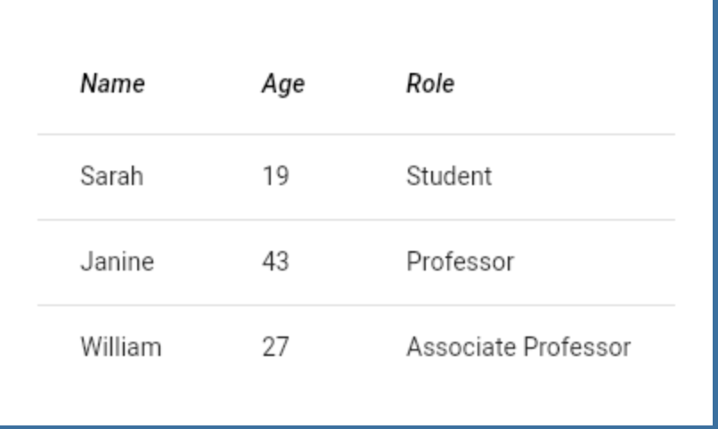

``` dart

 DataTable(
  columns: const <DataColumn>[
    DataColumn(
      label: Text(
        'Name',
      style: TextStyle(fontStyle: FontStyle.italic),
      ),
    ),
    DataColumn(
      label: Text(
      'Age',
      style: TextStyle(fontStyle: FontStyle.italic),
      ),
    ),
    DataColumn(
      label: Text(
        'Role',
      style: TextStyle(fontStyle: FontStyle.italic),
      ),
    ),
  ],
  rows: const <DataRow>[
    DataRow(
      cells: <DataCell>[
        DataCell(Text('Sarah')),
        DataCell(Text('19')),
        DataCell(Text('Student')),
        ],
      ),
    DataRow(
      cells: <DataCell>[
        DataCell(Text('Janine')),
        DataCell(Text('43')),
        DataCell(Text('Professor')),
      ],
    ),
    DataRow(
      cells: <DataCell>[
        DataCell(Text('William')),
        DataCell(Text('27')),
        DataCell(Text('Associate Professor')),
      ],
    ),
  ],
)
```
Ngoài ra còn có thể sort, select, edit,... trên table. (Sẽ bổ sung sau)


## 29. Flutter Widget: Dismissible

## 30. Flutter Widget: SilverGrid (Hải)
- Khi chúng ta phải hiển thị danh sách các mục trong CustomScrollView có thể được cuộn theo chiều ngang , SliverGrid sẽ được sử dụng. Nó có một thuộc tính có tên là ủy quyền chấp nhận SliverChildBuilderDelegate. Giống như SliverList, SliverGrid cũng được sử dụng khi số lượng các mục trong danh sách là không biết chẳng hạn như trong trường hợp khi có một nhu cầu để biểu hiện một danh sách có chứa câu trả lời từ một API server.

## 31. Flutter Widget: SilverAppBar (Hải)

- Là 1 material design app bar tích hợp với widget **CustomScrollView**. Widget này giúp cho phép chúng ta có thể dễ dàng tạo một app bar với nhiều kiểu khác nhau.
- Thường được thêm vào vị trí đầu tiên của **CustomScrollView**.

Đây là một đoạn mã basic tạo **SliverAppBar** chỉ bao gồm tiêu đề mà không có bất kỳ hiệu ứng nào.

```
slivers: <Widget>[
    SliverAppBar(
      title: Text("SliverAppBar Title"),
    )
  ],
```

**Shrinking Header**

- Hiệu ứng thu nhỏ title của app bar. Những gì chúng ta cần làm là thiết lập cho 2 thuộc tính `expandedHeight` và `flexibleSpace`.
 + `expandedHeight`: Chiều cao của app bar khi được mở rộng hoàn toàn.
 + `flexibleSpace`: Sẽ được phóng to ra khi app bar được mở rộng

- Để sửa đổi hành vi di chuyển, cần có 3 thuộc tính: `pinned`, `floating` và `snap`
 + `pinned`: Nếu value là true, thì app bar sẽ luôn luôn được hiển thị ở đầu chế độ xem khi scroll
 + `floating`: Giúp cho tính năng expand của app bar được hoạt động mỗi khi scroll lên, nếu giá trị là false thì phải scroll lên đầu thì mới thực hiện expand được.
 + `snap`: Thuộc tính này chỉ được sử dụng nếu `floating` là true

`pinned: true, floating: true, snap: false`

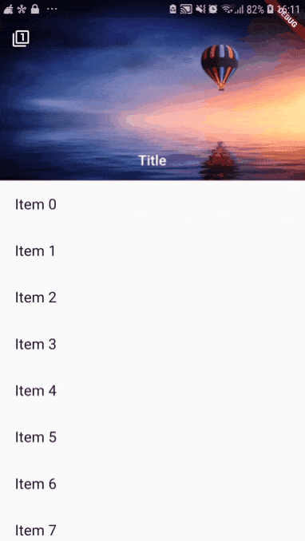

**Leading Widget**
- SliverAppBar còn cung cấp thêm một thuộc tính leading, ta có thể truyền vào một widget con thì nó sẽ được hiển thị ở bên trái title.


```
 SliverAppBar(
    leading: IconButton(
      icon: Icon(Icons.filter_1),
      onPressed: () {
        // Do something
      }
    ),
    ...
  ),
```


## 32. Flutter Widget: PageView
- Ở Flutter bạn có thể dễ dàng tạo ra một màn hình, Nhưng thật khó để tạo ra nhiều màn hình cũng một lúc và bạn có thể scroll giữa các màn hình với nhau. Và **PageView** sẽ giúp chúng ta giải quyết được vấn đề trên một cách dễ dàng.
   - PageView là gì?
     - Widget PageView này sẽ giúp bạn tạo một danh sách các trang có thể scroll trên màn hình của mình.    
   - Các bước tiến hành để có được một **PageView** như trên
     - Đầu tiên bạn cần làm là tạo một **PageCotroller** để quản lý việc **scroll** và **animation**, sử dụng **initialPage** để đặt trang bắt đầu.
       ```javascript
          final controller = PageController(
          initialPage: 0,
          );
       ```
     - Sau đó tạo các trang (các màn hình) bằng Widget **PageCotroller**, với controller là bộ điều khiển của các trang với nhau.
       ```javascript
          body: PageView(
          controller: controller,
          scrollDirection: scrollDirection,
          pageSnapping: true,
          children: <Widget>[
             Container(),
             Container(),
             Container(),
           ],
          ),
     ```
  - Một vidu cho bài trên
    
    https://user-images.githubusercontent.com/55979453/132809870-0eb14005-c4d8-4a49-8d6b-466478f2a635.mov

## 33. Flutter Widget: SnackBar

## 34. Flutter Widget: Drawer (An)
- Drawer là một màn hình bên vô hình thường chứa các mục menu và nó chiếm khoảng một nửa màn hình khi hiển thị. 

### 1. Create a Scaffold
- Để add một drawer ta sẽ bao bởi một Scaffold 

``` dart
Scaffold(
  drawer: // Add a Drawer here in the next step.
);
```

### 2. Add a drawer
``` dart
Scaffold(
  drawer: Drawer(
    child: // Populate the Drawer in the next step.
  ),
);
```

### 3. Populate the drawer with items

``` dart
Drawer(
  // Add a ListView to the drawer. This ensures the user can scroll
  // through the options in the drawer if there isn't enough vertical
  // space to fit everything.
  child: ListView(
    // Important: Remove any padding from the ListView.
    padding: EdgeInsets.zero,
    children: [
      const DrawerHeader(
        decoration: BoxDecoration(
          color: Colors.blue,
        ),
        child: Text('Drawer Header'),
      ),
      ListTile(
        title: const Text('Item 1'),
        onTap: () {
          // Update the state of the app.
          // ...
        },
      ),
      ListTile(
        title: const Text('Item 2'),
        onTap: () {
          // Update the state of the app.
          // ...
        },
      ),
    ],
  ),
);
```

### 4. Close the drawer programmatically
- Để đóng drawer ta sử dụng Navigator để remove khỏi stack.

``` dart
ListTile(
  title: const Text('Item 1'),
  onTap: () {
    // Update the state of the app
    // ...
    // Then close the drawer
    Navigator.pop(context);
  },
),
```

### 5. Example
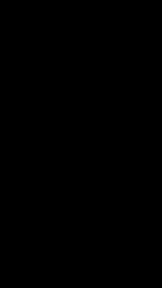

## 35. Flutter Widget: ClipOval(An)
- Một widget clips con của nó bằng cách sử dụng một hình oval.

``` dart
const ClipOval({Key? key, this.clipper, this.clipBehavior = Clip.antiAlias, Widget? child})
      : assert(clipBehavior != null),
        super(key: key, child: child);
```

- clipBehavior: Thiết lập cách cắt nội dung widget. 
Behavior mặc định cho hầu hết các widget là Clip.none nhưng với ClipOval là Clip.antiAlias. Có 3 loại cắt là Clip.hardEdge, Clip.antiAlias, Clip.antiAliasWithSaveLayer

- clipper: Nếu được chỉ định thuộc tính này sẽ xác định clip nào sẽ sử dụng trong số năm trình cắt dựng sẵn (ClipOval, ClipRect, ClipRRect và ClipPath) hoặc một custom clipper. Lớp con của bộ cắt mô tả khu vực được căn chỉnh theo trục của hình bầu dục. Nếu thuộc tính này được đặt thành null thì ClipOval theo mặc định sẽ lấy các ranh giới của đối tượng làm vùng được cắt bớt.


### 1. ClipOval 
``` dart
ClipOval(
      clipBehavior: Clip.antiAliasWithSaveLayer,
      clipper: MyCustomClipper(),
      child: Container(
        width: 200,
        height: 250,
        color: Colors.red,
      ),
    );
```
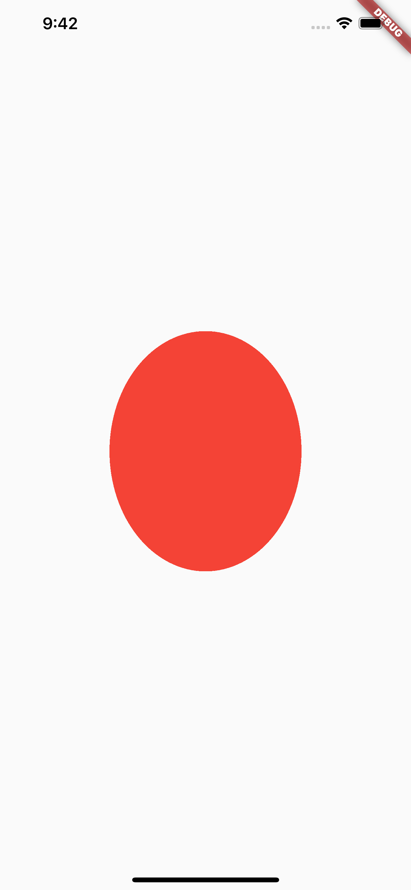

### 2. Custom Clipper

``` dart
class MyCustomClipper extends CustomClipper<Rect> {
  Rect getClip(Size size) {
    return Rect.fromLTWH(0, 0, 100, 100);
  }

  bool shouldReclip(oldClipper) {
    return false;
  }
}
```
``` dart
ClipOval(
      clipper: MyCustomClipper(),
      ...
    );
```

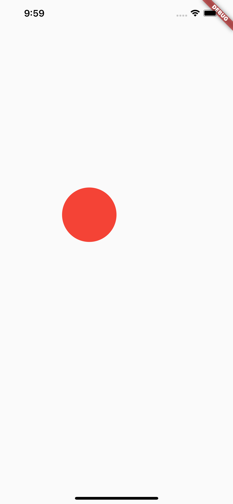


## 36. Flutter Widget: ClipPath (Anh)

- `ClipPath`:  Một tiện ích có thể cắt con của nó bằng cách sử dụng một đường dẫn

- Các thuộc tính mà có trong `ClipPath`:
    - `child`: Widget con
    - `clipBehavior`: Nội dung bên trong sẽ được cắt bớt theo tuỳ chọn này
    - `clipper`: Nếu không phải là null thì xác định clip sẽ sử dụng
    
- Example:
```
ClipPath(
    child: Image.network('https://scr.vn/wp-content/uploads/2020/07/%E1%BA%A2nh-thi%C3%AAn-nhi%C3%AAn-xanh-%C4%91%E1%BA%B9p-cho-m%C3%A0n-hinnhf-scaled.jpg'),
    clipper: MyClipper(),
),
```

```
class MyClipper extends CustomClipper<Path> {
  @override
  Path getClip(Size size) {
    // TODO: implement getClip
    var path = Path();
    // path.moveTo(size.width, 0.0);
    path.lineTo(size.width, size.height / 2);
    path.lineTo(0.0, size.height);
    path.close();
    return path;
  }

  @override
  bool shouldReclip(covariant CustomClipper<Path> oldClipper) {
    // TODO: implement shouldReclip
    return false;
  }
}
```

- Kết quả:

-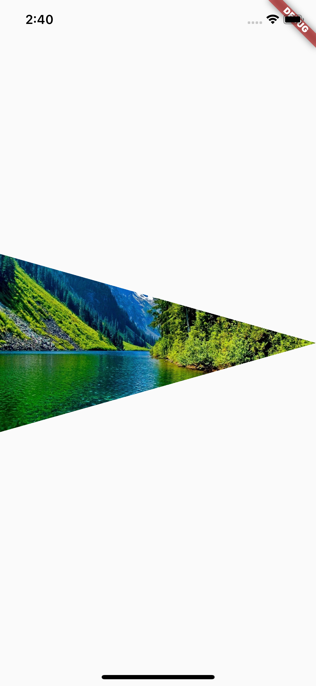

## 37. Flutter Widget: ShaderMask (Anh)
- `Shader Mask`: Một widget áp dụng một *mặt nạ* tạo bởi Shader tạo ra cho con của nó

- Các thuộc tính của `Shader Mask`:
    - `blendMode`: để sử dụng khi áp dụng shader cho đứa trẻ
        - `BlendMode.color`: Chế độ thuộc tính này chỉ cần sơn hình ảnh với các màu đã cho
        - `BlendMode.colorBurn`: Thuộc tính này vẽ hình ảnh với các hiệu ứng đảo ngược dựa trên màu sắc được cung cấp
        - `BlendMode.colorDodge`: Thuộc tính này vẽ hình ảnh với độ sáng dựa trên các màu được cung cấp
        - `BlendMode.clear`: Thuộc tính này loại bỏ *source* và *destination* và hiển thị một màn hình trong suốt
        - `BlendMode.src`: Viết tắt của source. Thuộc tính này hiển thị widget gốc / nguồn mà hình ảnh sẽ được vẽ
        - `BlendMode.dst`: Viết tắt cho đích. Thuộc tính này chỉ hiển thị điểm đến ban đầu (hình ảnh)
    - `shaderCallbacl`: Được gọi để tạo phi tiêu: ui.Shader tạo mặt nạ. [...]
        - `RadialGradient`: Điều này cho thấy các hiệu ứng gradient và màu sắc trong các vòng tròn đồng tâm
        - `LinearGradient`: Điều này chấp nhận *begin* và *end* là hai giới hạn tuỳ chọn theo sau color đó chấp nhận danh sách các màu sẽ được áp dụng cho child
        - `SweepGradient`: Điều này cho thấy các hiệu ứng gradient và màu sắc trong một vòng cung. Khi nói đến vòng cung, chúng ta nghĩ đến các góc. Gradient này cung cấp các thuộc tính như *startAngle* và *endAngle* thay đổi diện mạo theo yêu cầu.

- Ví dụ `RadialGradient`:
```
shaderCallback: (Rect bounds) {
    return RadialGradient(
        center: Alignment.center,
        radius: 0.5,
        colors: <Color>[Colors.blue, Colors.red],
        tileMode: TileMode.mirror,
        ).createShader(bounds);
},
```

-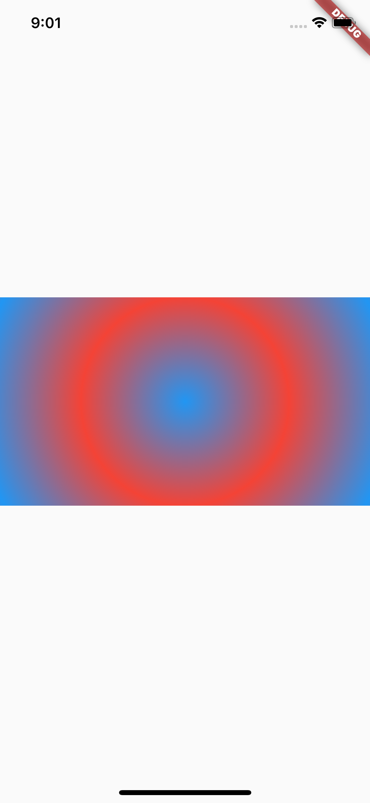

- Ví dụ `LinearGradient`:
```
shaderCallback: (Rect bounds) {
    return LinearGradient(
        begin: Alignment.topCenter,
        end: Alignment.bottomCenter,
        colors: [Colors.blue, Colors.red],
        tileMode: TileMode.mirror,
        ).createShader(bounds);
},
```

-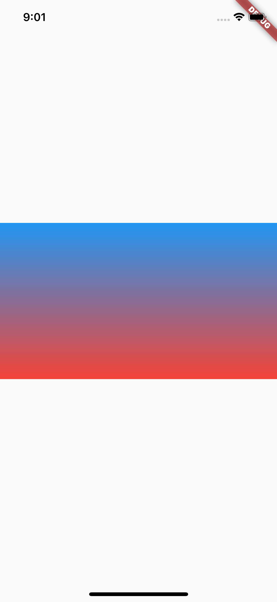

- Ví dụ `SweepGradient`:
```
shaderCallback: (Rect bounds) {
    return SweepGradient(
        colors: [Colors.red, Colors.blue],
        startAngle: 0.1,
        endAngle: 1)
        .createShader(bounds);
},
```

-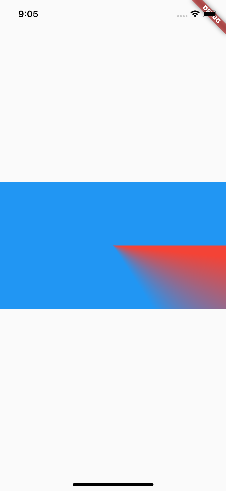
