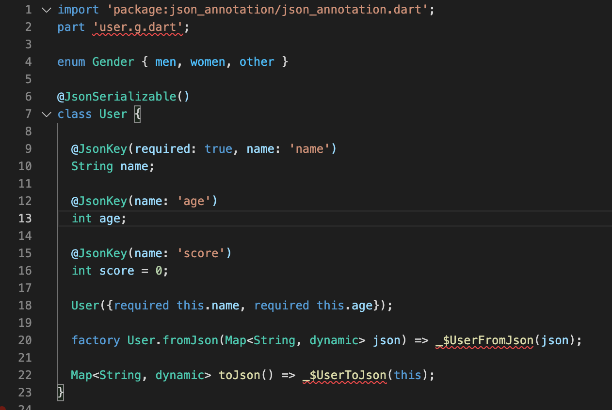

# FlutterLearning

# 1. Sử dụng JSON trong Flutter

  
**Cách parse JSON**
## Sử dụng `dart:convert`

- Chúng ta sẽ sử dụng bộ giải mã JSON tích hợp trong lib `dart:convert`. Chỉ cần truyền chuỗi json string cho hàm `jsonDecode()`, sau đó tìm kiếm các giá trị bạn cần trong `Map<String,dynamic>`.
	
  	
  	**Ví dụ**
  	
  	Chúng ta có 1 json string

  	```
  	{
 		 "name": "John Smith",
		 "email": "john@example.com"
	}
	```
	
	Chúng ta có thể decode json string bởi phương thức `jsonDecode()`, và kết quả trả về sẽ là kiểu dữ liệu `Map<String, dynamic>`.
	
	```
	Map<String, dynamic> user = jsonDecode(jsonString);

	print('Hello, ${user['name']}!');
	print('${user['email']}');
  	```

**Note: Cách giải mã này sẽ không hoạt động tốt khi dự án của bạn trở nên lớn hơn. Viết logic giải mã thủ công như thế này có thể trở nên khó quản lý và dễ xảy ra lỗi. Nếu bạn mắc lỗi đánh máy khi truy cập trường JSON không tồn tại, mã của bạn sẽ gặp lỗi trong thời gian chạy.**  

## Tích hợp việc xử lý giải mã JSON vào bên trong 1 model

Tạo một constructor dùng để khởi tạo đối tượng từ map và một method toJson để convert từ đối tượng qua map.

```
 User {
  final String name;
  final String email;

  User(this.name, this.email);

  User.fromJson(Map<String, dynamic> json)
      : name = json['name'],
        email = json['email'];

  Map<String, dynamic> toJson() => {
        'name': name,
        'email': email,
      };
}
```

Bây giờ việc decode đã được đưa vào bên trong model

```
Map<String, dynamic> userMap = jsonDecode(jsonString);
var user = User.fromJson(userMap);

print('Howdy, ${user.name}!');
print('We sent the verification link to ${user.email}.');
```

Để xử lý encode một user, chúng ta chỉ cần truyền một đối tượng user vào phương thức `jsonEncode()`, chúng ta không cần gọi hàm toJson(), `jsonEncode()` đã xử lý việc đó.

```
String json = jsonEncode(user);
```

## Sử dụng code generation lib
  
  + json_serializable: Cho phép xử lý mã hoá thông thường bằng cách sử dụng annotations
  + built_value: Cung cấp cách xử lý mã hoá highlevel về khai báo immutable value class

**Thiết lập `json_serializable` vào 1 project, chúng ta sẽ import lib vào dự án bằng cách**

```
dependencies:
  # Your other regular dependencies here
  json_annotation: <latest_version>

dev_dependencies:
  # Your other dev_dependencies here
  build_runner: <latest_version>
  json_serializable: <latest_version>
```

`dev_dependencies` là những dependencies không bao gồm trong source code của chúng ta, chúng chỉ được sử dụng trong môi trường dev


**Tạo model class theo cách `json_serializable`**

- Bây giờ chúng ta sẽ convert class User ở trên thành một class `json_serializable`.

```
import 'package:json_annotation/json_annotation.dart';

/// This allows the `User` class to access private members in
/// the generated file. The value for this is *.g.dart, where
/// the star denotes the source file name.
part 'user.g.dart';

/// An annotation for the code generator to know that this class needs the
/// JSON serialization logic to be generated.
@JsonSerializable()
class User {
  User(this.name, this.email);

  String name;
  String email;

  /// A necessary factory constructor for creating a new User instance
  /// from a map. Pass the map to the generated `_$UserFromJson()` constructor.
  /// The constructor is named after the source class, in this case, User.
  factory User.fromJson(Map<String, dynamic> json) => _$UserFromJson(json);

  /// `toJson` is the convention for a class to declare support for serialization
  /// to JSON. The implementation simply calls the private, generated
  /// helper method `_$UserToJson`.
  Map<String, dynamic> toJson() => _$UserToJson(this);
}
```

Với setup này, code sẽ được generate ra nhằm phục vụ cho việc encode và decode cho các trường `name` và `email`.

Trong trường mình gặp vấn đề với cách đặt tên theo format snake, chữ hoa chữ thường, thì lib này cũng cho phép ta custom lại key bằng cách sử dụng `@JsonKey` annotation cùng với parameter.

**Ví dụ:**

```
@JsonKey(name: 'user_name')
String name;
```

Mình còn có thể sử dụng 1 cách nữa để có thể xử lý mã hoá theo format snake

```
@JsonSerializable(fieldRename: FieldRename.snake)
```

Ngoài ra, lib còn có thể giúp ta kiểm tra và ràng buộc dữ liệu như `defaultValue`, `required`,...

**Ví dụ:**

```
/// Tell json_serializable to use "defaultValue" if the JSON doesn't
/// contain this key or if the value is `null`.
@JsonKey(defaultValue: false)
final bool isAdult;

/// When `true` tell json_serializable that JSON must contain the key, 
/// If the key doesn't exist, an exception is thrown.
@JsonKey(required: true)
final String id;

/// When `true` tell json_serializable that generated code should 
/// ignore this field completely. 
@JsonKey(ignore: true)
final String verificationCode;
```

**Chạy Generate code**

Khi tạo `json_serializable` class và chạy sẽ gặp lỗi biên dịch này


Lỗi này là do những đoạn code này chưa tồn tại, để giải quyết vấn đề này thì ta cần phải chạy generate code.

Có 2 cách để chạy code generate

- Thủ công: `flutter pub run build_runner build`
- Tự động: `flutter pub run build_runner watch`

 

# 2. Hướng dẫn Sql trong Flutter

- `Database`: là một tập hợp dữ liệu có tổ chức, hỗ trợ việc lưu trữ và thao tác dữ liệu và được truy cập điện tử từ hệ thống máy tính. Chúng ta có thể tổ chức dữ liệu thành các hàng, cột, bảng và chỉ mục. Nó giúp cho việc quản lý dữ liệu trở nên dễ dàng

- Flutter cung cấp nhiều gói để làm với cơ sở dữ liệu. Các gói phổ biến và được sử dụng nhiều nhất là:
    - `sqflite`: Nó cho phép truy cập và thao tác với CSDL `SQLite`
    - `Firebase`: Nó sẽ cho phép bạn truy cập và thao tác với CSDL đám mây

- Chúng ta sẽ tìm hiểu về `SQLite`. Vậy `SQLite` là gì?

- `SQLite` là một thư viện phần mềm cơ sở dữ liệu phổ biến cung cấp hệ thống quản lý cơ sở dữ liệu quan hệ để lưu trữ cục bộ / máy khách. Nó là một công cụ cơ sở dữ liệu nhẹ và được kiểm tra theo thời gian và chứa các tính năng như công cụ cơ sở dữ liệu SQL giao dịch độc lập, không cần máy chủ, không cấu hình

- Flutter SDK không hỗ trợ SQLite trực tiếp. Thay vào đó, nó cung cấp một plugin `sqflite` thực hiện tất cả các hoạt động trên cơ sở dữ liệu tương tự như thư viện `SQLite`. `Sqflite` cung cấp hầu hết các chức năng cốt lõi liên quan đến cơ sở dữ liệu như sau:
    - Nó tạo hoặc mở cơ sở dữ liệu SQLite
    - Nó có thể thực thi các câu lệnh SQL một cách dễ dàng
    - Nó cung cấp một phương pháp truy vấn nâng cao để lấy thông tin từ cơ sở dữ liệu SQLite
    
- Chúng ta sẽ đi từng bước lưu trữ và tìm nạp dữ liệu trong Flutter:
+ Bước 1: Đầu tiên, vào tệp **pubspec.yaml** để thêm các packages.

```
dependencies:
  flutter:
    sdk: flutter
  sqflite:
  path:
```

+ Bước 2: Tạo một class. Ở bước này chúng ta cần phải xác định dữ liệu cần lưu trữ trước khi tạo bảng để lưu trữ thông tin
```
class Book {
  final int id;
  final String title;
  final int price;

  Book({required this.id, required this.title, required this.price});
}
```

+ Bước 3: Mở cơ sở dữ liệu. Tại đây, chúng ta cần mở kết nối cơ sở dữ liệu. Nó yêu cầu hai bước:
1. Đặt đường dẫn cơ sở dữ liệu bằng cách sử dụng phương thức **getDatabasePath()** và kết hợp nó với gói đường dẫn
2. Sử dụng hàm **openDatabase()** để mở cơ sở dữ liệu

```
final dataBase = openDatabase(
    join(await getDatabasesPath(), 'book_database.db'),
);
```

+ Bước 4: Tạo bảng. Ở bước này, chúng ta cần phải tạo một bảng lưu trữ thông tin về các cuốn book. Ở đây, chúng ta sẽ tạo một bảng có tên book, trong đó có *id*, *title* và *price* của book.
```
final dataBase = openDatabase(
  join(await getDatabasesPath(), 'book_database.db'),
  onCreate: (db, version) {
    return db.execute(
      'CREATE TABLE books(id INTEGER PRIMARY KEY, title TEXT, price INTEGER)',
    );
  },
  version: 1,
);
```

+ Bước 5: Chèn book vào cơ sở dữ liệu. Ở đây, bạn phải lưu trữ thông tin trên bảng về các cuốn book khác nhau. Chèn một cuốn book vào bảng gồm có 2 bước:
1. Chuyển book thành map
2. Sử dụng phương thức insert()

```
class Book {
  final int id;
  final String title;
  final int price;

  Book({required this.id, required this.title, required this.price});

  Map<String, dynamic> toMap() {
    return {
      'id': id,
      'title': title,
      'price': price,
    };
  }

  @override
  String toString() {
    return 'Book{id: $id, title: $title, price: $price}';
  }
}
```

```
Future<void> insertBook(Book book) async {
  final db = await dataBase;

  await db.insert('books', book.toMap(),
      conflictAlgorithm: ConflictAlgorithm.replace);
}
```

```
var b1 =
    Book(id: 0, title: 'Tuoi 20 toi da song nhu 1 bong hoa dai', price: 750);

await insertBook(b1);
```

- Bước 6: Lấy danh sách book. Bây giờ, chúng ta đã lưu book vào cơ sở dữ liệu và bạn có thể sử dụng **query()** để truy xuất một cuốn sách cụ thể hoặc tất cả các cuốn sách. Nó gồm 2 bước:
1. Chạy một query trả về List<Map>
2. Chuyển List<Map> thành List<Book>

```
Future<List<Book>> books() async {
  final db = await dataBase;

  final List<Map<String, dynamic>> maps = await db.query('books');

  return List.generate(maps.length, (index) {
    return Book(
        id: maps[index]['id'],
        title: maps[index]['title'],
        price: maps[index]['price']);
  });
}

print(await books());
```

- Bước 7: Cập nhật book trong cơ sở dữ liệu. Bạn có thể sử dụng phương thức **update()** để cập nhật book mà bạn muốn. Nó bao gôm 2 bước:
1. Chuyển đổi book thành Map
2. Sau đó, sử dụng mệnh đề *where* để cập nhật book

```
Future<void> updateBook(Book book) async {
  final db = await dataBase;

  await db
      .update('books', book.toMap(), where: 'id = ?', whereArgs: [book.id]);
}

b1 = Book(id: 0, title: 'Dac nhan tam', price: 1500);
await updateBook(b1);
```

- Bước 8: Xoá book khỏi cơ sở dữ liệu. Bạn có thể sử dụng phương thức **delete()** để xoá cơ sở dữ liệu. Đối với điều này, bạn cần tạo một hàm lấy *id* và xoá cơ sở dữ liệu của *id* phù hợp
```
Future<void> deleteBook(int id) async {
  final db = await dataBase;

  await db.delete('books', where: 'id = ?', whereArgs: [id]);
}
await deleteBook(0);
```

# 3. Sử dụng `http` lấy dữ liệu từ REST API

Tìm và nạp dữ liệu từ API là cần thiết cho hầu hết các ứng dụng. Trong bài này thì sẽ sử dụng [http](https://pub.dev/packages/http) package để làm việc với api.

## 1. Thêm `http` package vào project

Để cài đặt gói này thì chúng ta thêm vào những dòng sau đây vào file `pubspec.yaml`, sau đó lưu lại.

```
dependencies:
  http: <latest_version>
```

Để sử dụng thì ta sẽ import vào file như thế này

```
import 'package:http/http.dart' as http;
```

Ngoài ra, bên android thì chúng ta sẽ cần xin thêm quyền truy cập internet ở file `AndroidManifest.xml`

```
<uses-permission android:name="android.permission.INTERNET" />
```

## 2. Tạo một request API

```
Future<http.Response> fetchAlbum() {
  return http.get(Uri.parse('https://jsonplaceholder.typicode.com/albums/1'));
}
```

Phương thức `http.get()` sẽ trả về một **Future** có chứa bên trong là **Response**

- **Future** là một class làm việc với các hoạt động bất đồng bộ
- **Response** là một class chứa dữ liệu sau khi request api.

